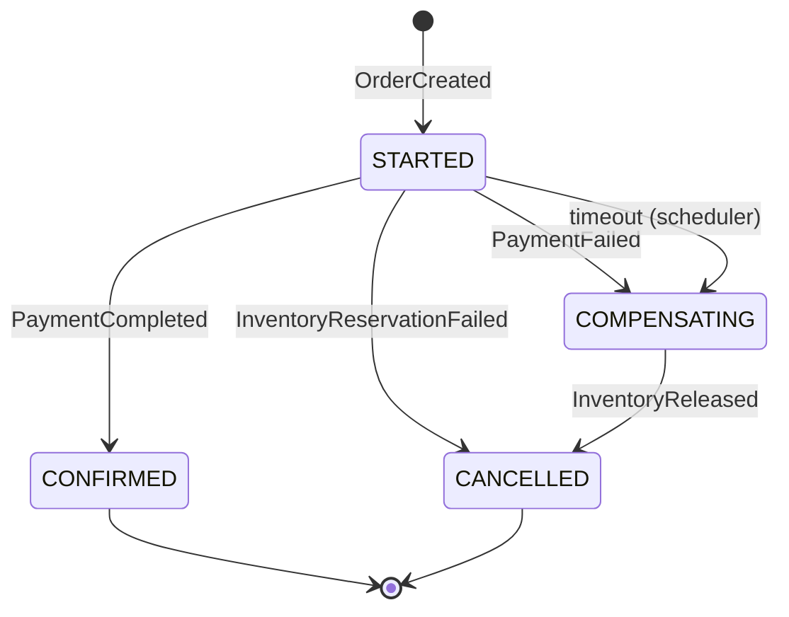

# Architecture — saga-fulfillment-engine

An order fulfillment system built on the **orchestration-based Saga pattern**, with a
scheduler that drives timeout-based compensation for sagas that stall.

This document is the design reference for the project. It is updated in the same commit
as any change that affects design.

**Status:** Chunk 0 (architecture + scaffolding). No business logic implemented yet.

---

## 1. Goals and non-goals

### Goals

This is a **portfolio / learning project**. It exists to demonstrate, in working code:

- **Distributed transactions via the Saga pattern** — maintaining consistency across
  service boundaries without a distributed two-phase commit, using a sequence of local
  transactions plus compensating actions.
- **Orchestration, not choreography** — a single component owns the decision of what
  happens next, so the workflow is readable in one place instead of being smeared across
  event handlers.
- **Async, event-driven service communication** — services talk over Kafka, never by
  synchronous inter-service HTTP calls.
- **Timeout-based compensation** — a saga that never receives its next reply must not
  hang forever. A scheduler detects stalled sagas and drives them down the compensation
  path.
- **Idempotent message handling** — Kafka delivery is at-least-once, so handlers must
  tolerate redelivery without double-reserving inventory or double-charging a customer.
- **Distributed locking** — multiple scheduler instances must not act on the same stuck
  saga concurrently.

### Non-goals

- **Not production payment processing.** There is no integration with any real payment
  gateway. `payment-service` simulates outcomes (success/failure/delay) so the
  compensation paths can be exercised deterministically. Nothing here is PCI-compliant
  and none of it should be pointed at real money.
- **No real authentication, authorization, or multi-tenancy.**
- **No production hardening** — no rate limiting, no autoscaling, no SLA, no DR plan.
- **Not a Kafka Streams / event-sourcing showcase.** Saga state is kept in a relational
  table, deliberately, because that is the simpler and more explainable design.
- **Not a UI project.** REST endpoints and logs are the interface.

---

## 2. Services

> **Derived section.** The prompt referenced a service list that was not included, so
> these responsibilities are reconstructed from the saga flow in §3. Correct anything
> that diverges from the intended split.

| Service | Responsibility |
| --- | --- |
| **order-service** | Owns the `Order` aggregate and its lifecycle (`PENDING` → `CONFIRMED`/`CANCELLED`). Exposes the client-facing REST API for creating and reading orders. Publishes `OrderCreated`. Consumes `ConfirmOrder` / `CancelOrder` commands and applies the resulting status change. Source of truth for order data — **not** for saga state. |
| **inventory-service** | Owns stock levels and reservations. Consumes `ReserveInventory`, attempts to reserve, and reports `InventoryReserved` or `InventoryReservationFailed`. Consumes `ReleaseInventory` as the compensating action and reports `InventoryReleased`. Must be idempotent (§6). |
| **payment-service** | Owns payment records. Consumes `ProcessPayment` and reports `PaymentCompleted` or `PaymentFailed`. Payment outcome is **simulated** (§1 non-goals). Must be idempotent (§6) — this is where double-processing is most costly. |
| **notification-service** | Terminal-state side effects only. Consumes `OrderConfirmed` / `OrderCancelled` and emits a customer notification (logged/stubbed). Deliberately has no compensating action — a sent notification cannot be un-sent, which is why it runs only on terminal states. |
| **saga-orchestrator** | The brain. Owns the `Saga` record and its state machine (`STARTED` → `CONFIRMED` / `COMPENSATING` → `CANCELLED`). Consumes `OrderCreated` and every service reply, and is the **only** component that decides which command is issued next. Also owns each saga's timeout deadline, and exposes a query API used by `scheduler-service`. |
| **scheduler-service** | Liveness watchdog. Periodically asks `saga-orchestrator` for sagas past their deadline that are still in a non-terminal state, takes a Redis lock keyed by saga id, and triggers the same compensation path an explicit failure would (§4). Holds no saga state of its own. |

---

## 3. Saga flow

The happy path and both failure paths, explicitly. `saga-orchestrator` is the only
decision-maker at every branch.

### 3.1 Happy path

1. Client `POST`s to **order-service** to create an order. The order is persisted with
   status **`PENDING`**.
2. **order-service** publishes **`OrderCreated`**.
3. **saga-orchestrator** consumes `OrderCreated`, creates a saga record with status
   **`STARTED`** and a **timeout deadline**, then publishes the **`ReserveInventory`**
   command.
4. **inventory-service** consumes `ReserveInventory`, attempts the reservation, and
   publishes **`InventoryReserved`** on success.
5. **saga-orchestrator** consumes `InventoryReserved` and publishes the
   **`ProcessPayment`** command.
6. **payment-service** consumes `ProcessPayment` and publishes **`PaymentCompleted`** on
   success.
7. **saga-orchestrator** consumes `PaymentCompleted`, marks the saga **`CONFIRMED`**, and
   publishes **`OrderConfirmed`**.
8. **order-service** marks the order **`CONFIRMED`**; **notification-service** notifies
   the customer. Saga is terminal.

### 3.2 Failure path A — inventory reservation fails

Nothing has been reserved and nothing has been charged, so **no compensation is
required** — this is a straight cancellation.

1. Steps 1–3 as above.
2. **inventory-service** cannot reserve and publishes
   **`InventoryReservationFailed`**.
3. **saga-orchestrator** consumes it, marks the saga **`CANCELLED`**, and publishes the
   **`CancelOrder`** command.
4. **order-service** marks the order **`CANCELLED`**. Saga is terminal.

### 3.3 Failure path B — payment fails after inventory was reserved

This is the path that actually needs compensation: inventory is held and must be given
back.

1. Steps 1–5 as in the happy path — inventory **is** reserved.
2. **payment-service** publishes **`PaymentFailed`**.
3. **saga-orchestrator** consumes it, marks the saga **`COMPENSATING`**, and publishes
   **both**:
   - **`ReleaseInventory`** — the compensating command, and
   - **`CancelOrder`**.
4. **inventory-service** releases the reservation and confirms with
   **`InventoryReleased`**; **order-service** marks the order **`CANCELLED`**.
5. Once compensation is confirmed, **saga-orchestrator** moves the saga
   **`COMPENSATING` → `CANCELLED`**. Saga is terminal.

> The saga only reaches `CANCELLED` **after** compensation is acknowledged. A saga
> sitting in `COMPENSATING` means inventory has not yet been confirmed released — that
> distinction is what makes the state machine worth having, and it is exactly what §8
> tests hardest.

### 3.4 State machine



`CONFIRMED` and `CANCELLED` are terminal. `STARTED` and `COMPENSATING` are non-terminal
and therefore eligible for timeout sweeping.

---

## 4. Timeout and scheduler flow

A saga stalls when a reply never arrives — a consumer is down, a message was dropped, a
service crashed mid-handler. Without a watchdog the saga sits in `STARTED` forever while
inventory stays reserved.

**scheduler-service** runs on a fixed interval and:

1. **Queries `saga-orchestrator`** for sagas whose **timeout deadline has passed** and
   whose status is still **non-terminal** (`STARTED` or `COMPENSATING`).
2. For each such saga, **acquires a Redis lock keyed by saga id** before doing anything.
   The lock is what makes it safe to run more than one scheduler instance: exactly one
   instance handles a given stuck saga. A saga whose lock cannot be acquired is skipped
   this pass and retried next pass.
3. **Triggers the same compensation path an explicit failure would** — it does not
   invent a second recovery mechanism. A timed-out saga is routed into the identical
   `COMPENSATING` transition described in §3.3, so there is one compensation code path
   to reason about and to test.
4. **Releases the lock.** Locks carry a TTL so a scheduler that dies mid-pass does not
   wedge a saga permanently.

Design constraints worth stating:

- The lock TTL must exceed the expected handling time, or two instances could overlap.
- Because compensation is reachable both from an explicit `PaymentFailed` and from a
  timeout, compensation handlers must themselves be **idempotent** — a late reply can
  still arrive after the scheduler has already compensated.
- The scheduler is a *liveness* mechanism, not a *correctness* one. Correctness comes
  from the state machine; the scheduler only guarantees the saga eventually leaves a
  non-terminal state.

---

## 5. Kafka topic design

### 5.1 Orchestration, not choreography

**Only `saga-orchestrator` decides the next step.** Every other service is a pure
executor: it consumes a command addressed to it, performs one local transaction, and
publishes a result event. No service consumes another service's event and independently
decides to act on it. There is no implicit workflow hiding in the wiring.

Concretely: `inventory-service` never listens for `PaymentFailed` and decides to release
stock on its own. It waits to be told, via `ReleaseInventory`. That indirection is the
entire point of orchestration — the workflow lives in one readable state machine instead
of being an emergent property of who happens to subscribe to what.

### 5.2 Naming convention

```
<context>.<kind>.<name>.v<n>
```

- `<context>` — the owning bounded context (`order`, `inventory`, `payment`, `saga`)
- `<kind>` — `commands` (imperative, addressed to exactly one consumer, "do this") or
  `events` (past tense, a fact, broadcast, "this happened")
- `<name>` — kebab-case message name
- `v<n>` — schema version, so a breaking payload change is a new topic rather than a
  silent break

### 5.3 Topics

**Commands** — published by `saga-orchestrator`, consumed by the owning service:

| Topic | Consumer |
| --- | --- |
| `inventory.commands.reserve-inventory.v1` | inventory-service |
| `inventory.commands.release-inventory.v1` | inventory-service (compensation) |
| `payment.commands.process-payment.v1` | payment-service |
| `order.commands.confirm-order.v1` | order-service |
| `order.commands.cancel-order.v1` | order-service |

**Events** — published by the owning service, consumed by `saga-orchestrator` (and by
`notification-service` for terminal states):

| Topic | Producer |
| --- | --- |
| `order.events.order-created.v1` | order-service |
| `inventory.events.inventory-reserved.v1` | inventory-service |
| `inventory.events.inventory-reservation-failed.v1` | inventory-service |
| `inventory.events.inventory-released.v1` | inventory-service |
| `payment.events.payment-completed.v1` | payment-service |
| `payment.events.payment-failed.v1` | payment-service |
| `order.events.order-confirmed.v1` | order-service |
| `order.events.order-cancelled.v1` | order-service |

### 5.4 Partitioning and ordering

All messages are **keyed by saga id** (order id for `OrderCreated`, which precedes saga
creation). Same key → same partition → per-saga ordering is preserved, which is the only
ordering guarantee the state machine actually needs. Ordering *across* sagas is
irrelevant and is deliberately not guaranteed.

### 5.5 Message envelope

Every message carries, at minimum:

| Field | Purpose |
| --- | --- |
| `messageId` | Unique per message. The idempotency key (§6). |
| `sagaId` | Correlation across the whole saga. Also the partition key. |
| `orderId` | Business correlation. |
| `type` | Message type discriminator. |
| `occurredAt` | Timestamp. |

---

## 6. Idempotency

**Kafka delivery is at-least-once.** A consumer that processes a message, then dies
before committing its offset, will see that message again on restart. Rebalances cause
the same thing. This is normal operation, not an error case.

Without protection, that means:

- `inventory-service` **double-reserves** stock — the same order silently consumes twice
  its quantity.
- `payment-service` **double-charges** the customer.

**Requirement:** `inventory-service` and `payment-service` must each track the
`messageId`s of commands they have already processed, and treat a repeat as a no-op that
re-publishes the original result rather than redoing the work. The natural
implementation is a `processed_message` table written **in the same local transaction**
as the business change, so the dedup record and the effect commit atomically or not at
all.

The same applies to compensating commands — §4 notes that compensation is reachable from
both an explicit failure and a timeout, so `ReleaseInventory` can genuinely arrive twice.

`saga-orchestrator` needs the equivalent protection on the reply side: a duplicated
`PaymentCompleted` must not drive a second `OrderConfirmed`. Its state machine helps here
(a transition out of `CONFIRMED` is already invalid) but explicit dedup is still the
clearer guarantee.

### 6.1 order-service is a special case

`order-service` does **not** need a `processed_message` table, and deliberately does not
have one. Its two commands both drive the order into a *terminal* status, and the order
records which status it reached — so the order's own `status` column already is the
idempotency key. A redelivered `ConfirmOrder` against an order that is already
`CONFIRMED` is detectably redundant with no extra bookkeeping.

That reasoning does **not** transfer to `inventory-service` or `payment-service`:
"reserve 3 units" and "charge $40" are not self-describing, so replaying them is
indistinguishable from a legitimate second request. Those services need the explicit
dedup table.

`order-service` therefore distinguishes three non-applying outcomes, all logged no-ops
rather than errors:

| Outcome | Condition |
| --- | --- |
| `DUPLICATE_IGNORED` | Order already holds the requested status — plain redelivery. |
| `CONFLICT_IGNORED` | Order is terminal in the *other* status. A terminal order never flips. |
| `ORDER_NOT_FOUND` | No such order. Ignored rather than thrown, so the consumer cannot spin on a poison message. |

> **Implementation happens in a later chunk** for the other services. This section records
> the requirement so it is not rediscovered late.

---

## 7. Repository structure

**Maven multi-module monorepo.** One deployable artifact per module; a single repository
for portfolio manageability.

The reasoning: six separately-deployable services genuinely are six artifacts, and each
module builds its own runnable jar — the module boundary is real, not cosmetic. But six
separate repositories for a portfolio project would mean six clone URLs, six CI configs,
and cross-cutting changes split across six pull requests, for zero benefit at this scale.
A reviewer should be able to read the whole system in one place.

```
saga-fulfillment-engine/
├── pom.xml                  # parent (packaging: pom) — module list, dependency mgmt
├── ARCHITECTURE.md
├── README.md
├── order-service/
├── inventory-service/
├── payment-service/
├── notification-service/
├── saga-orchestrator/
└── scheduler-service/
```

Shared message contracts currently live per-service. If duplication becomes painful, a
`common-contracts` module is the intended escape hatch — deliberately deferred rather
than built speculatively.

---

## 8. Testing strategy

### 8.1 Unit tests

Per service, fast, no infrastructure. Business rules in isolation: state machine
transitions, reservation arithmetic, payment outcome simulation, deadline computation.

The `saga-orchestrator` state machine is a pure function of (current state, incoming
event) and should be tested exhaustively at this level — including transitions that must
be **rejected**.

### 8.2 Integration tests — Testcontainers

Real **Kafka**, **Postgres**, and **Redis** in containers. No embedded fakes, no mocked
brokers; the redelivery and locking semantics under test only exist in the real thing.

Covers: publish/consume round-trips, persistence, and Redis lock acquisition/expiry.

### 8.3 Failure and compensation paths — the part that matters

Happy-path tests prove almost nothing about a Saga system. The value of this project is
in what happens when steps fail, and that is exactly what tends to be under-tested. Each
of the following is an explicit, named test case:

1. **Inventory reservation fails** (§3.2) → saga reaches `CANCELLED`, order is
   `CANCELLED`, and **no** `ProcessPayment` is ever published.
2. **Payment fails after reservation** (§3.3) → saga passes **through** `COMPENSATING`,
   `ReleaseInventory` is published, stock returns to its pre-saga level, and the saga
   only then reaches `CANCELLED`. Asserting the intermediate state is the point — a test
   that only checks the final status would pass even if compensation never ran.
3. **Timeout with no reply** (§4) → a saga is created, the reply is deliberately never
   sent, and the scheduler drives it into the same compensation path. Asserted by
   advancing a controllable clock, not by sleeping.
4. **Duplicate command delivery** (§6) → the same `ReserveInventory` / `ProcessPayment`
   is delivered twice; stock is decremented **once** and the customer is charged
   **once**. This test must fail before idempotency is implemented, or it is not testing
   anything.
5. **Concurrent schedulers on one stuck saga** (§4) → two scheduler instances sweep the
   same saga simultaneously; the Redis lock ensures compensation is triggered exactly
   once.
6. **Late reply after compensation** (§4) → a `PaymentCompleted` arrives *after* the
   scheduler already compensated. The saga must not resurrect into `CONFIRMED`.
7. **Compensation itself fails** → `ReleaseInventory` errors. The saga must remain in
   `COMPENSATING` and stay visible to the scheduler for retry, rather than being
   silently marked `CANCELLED`.

Cases 6 and 7 are the ones most often missed, and are the reason the `COMPENSATING`
state is modelled explicitly rather than collapsed into `CANCELLED`.

---

## 9. Git branching strategy

> **Assumed** from the project's standing rules — "same as before" referenced a prior
> convention not restated in this prompt.

- Work happens on **`feature/<short-name>`** or **`fix/<short-name>`** branches.
- **Never commit directly to `main`** unless explicitly instructed.
- One branch per chunk, matching the checklist in §10.
- A change that affects design updates **`ARCHITECTURE.md` in the same commit**.
- The §10 checklist is updated as part of the chunk it describes.

---

## 10. Chunk checklist

> **Service ordering is authoritative.** The Chunk 0 draft of this list was derived from
> the architecture rather than supplied, and put `saga-orchestrator` before
> `inventory-service` and `payment-service`. The intended sequence is the reverse: build
> every executor service first, then the orchestrator that drives them, then the
> scheduler.
>
> **order-service → inventory-service → payment-service → notification-service →
> saga-orchestrator → scheduler-service.**
>
> Non-service chunks (idempotency, integration suite, docs) are interleaved where they
> make sense and do not change that sequence.

Update after every chunk.

- [x] **Chunk 0 — Architecture and scaffolding.** `ARCHITECTURE.md`, root multi-module
      `pom.xml`, six empty skeleton modules, `.gitignore`, `README.md` stub, git init.
      *Branch: `main` (explicitly authorized).*
- [x] **Chunk 1 — order-service.** `Order` entity and persistence, REST API for create
      and read, `PENDING` status, publishes `OrderCreated`, consumes `ConfirmOrder` /
      `CancelOrder` with consumer-level idempotency (§6.1). *Branch:
      `feature/order-service`.*
      **Caveat:** the Testcontainers integration tests are written but have never
      executed — Docker is unreachable from the dev machine (see README). Only the unit
      tests are proven green.
- [ ] **Chunk 2 — inventory-service.** Stock model, `ReserveInventory` and
      `ReleaseInventory` handlers, publishes `InventoryReserved` /
      `InventoryReservationFailed` / `InventoryReleased`. *Branch:
      `feature/inventory-service`.*
- [ ] **Chunk 3 — payment-service.** Payment record, simulated outcomes, consumes
      `ProcessPayment`, publishes `PaymentCompleted` / `PaymentFailed`. *Branch:
      `feature/payment-service`.*
- [ ] **Chunk 4 — notification-service.** Consumes terminal-state events, stubbed
      notification delivery. *Branch: `feature/notification-service`.*
- [ ] **Chunk 5 — saga-orchestrator.** `Saga` entity, timeout deadline, and the complete
      state machine in one pass: consumes `OrderCreated`, issues `ReserveInventory`, then
      `ProcessPayment` on success, compensation on payment failure, and the
      `STARTED` / `CONFIRMED` / `COMPENSATING` / `CANCELLED` transitions of §3.
      *Branch: `feature/saga-orchestrator`.*
- [ ] **Chunk 6 — idempotency.** `processed_message` dedup in inventory-service,
      payment-service, and the orchestrator (§6). Lands before scheduler-service because
      §4 compensation is reachable from both an explicit failure and a timeout, so the
      scheduler's correctness depends on these handlers already being idempotent.
- [ ] **Chunk 7 — scheduler-service.** Timeout sweep, orchestrator query API, Redis
      distributed lock, compensation trigger (§4). *Branch: `feature/scheduler-service`.*
- [ ] **Chunk 8 — integration test suite.** Testcontainers harness plus all seven
      failure/compensation cases in §8.3.
- [ ] **Chunk 9 — local run and docs.** `docker-compose` for Kafka/Postgres/Redis,
      README run instructions, observability pass.
