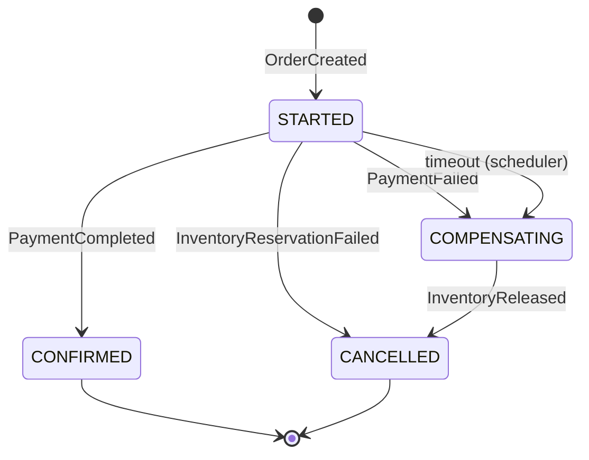

# Architecture — saga-fulfillment-engine

An order fulfillment system built on the **orchestration-based Saga pattern**, with a
scheduler that drives timeout-based compensation for sagas that stall.

This document is the design reference for the project. It is updated in the same commit
as any change that affects design.

**Status:** Chunk 0 (architecture + scaffolding). No business logic implemented yet.

---

## 1. Goals and non-goals

### Goals

This is a **portfolio / learning project**. It exists to demonstrate, in working code:

- **Distributed transactions via the Saga pattern** — maintaining consistency across
  service boundaries without a distributed two-phase commit, using a sequence of local
  transactions plus compensating actions.
- **Orchestration, not choreography** — a single component owns the decision of what
  happens next, so the workflow is readable in one place instead of being smeared across
  event handlers.
- **Async, event-driven service communication** — services talk over Kafka, never by
  synchronous inter-service HTTP calls.
- **Timeout-based compensation** — a saga that never receives its next reply must not
  hang forever. A scheduler detects stalled sagas and drives them down the compensation
  path.
- **Idempotent message handling** — Kafka delivery is at-least-once, so handlers must
  tolerate redelivery without double-reserving inventory or double-charging a customer.
- **Distributed locking** — multiple scheduler instances must not act on the same stuck
  saga concurrently.

### Non-goals

- **Not production payment processing.** There is no integration with any real payment
  gateway. `payment-service` simulates outcomes (success/failure/delay) so the
  compensation paths can be exercised deterministically. Nothing here is PCI-compliant
  and none of it should be pointed at real money.
- **No real notification delivery.** `notification-service` renders a customer message and
  writes it to the log. There is no email, SMS, or push integration, and no notification
  history — the `NotificationSender` interface is where a real channel would attach.
- **No service discovery.** There is no Eureka, Consul, or Spring Cloud dependency
  anywhere in the project, and none is planned. Services find Kafka and their own database
  through configuration; they never call each other directly (§1), so there is nothing for
  a registry to resolve.
- **No real authentication, authorization, or multi-tenancy.**
- **No production hardening** — no rate limiting, no autoscaling, no SLA, no DR plan.
- **Not a Kafka Streams / event-sourcing showcase.** Saga state is kept in a relational
  table, deliberately, because that is the simpler and more explainable design.
- **Not a UI project.** REST endpoints and logs are the interface.

---

## 2. Services

> **Derived section.** The prompt referenced a service list that was not included, so
> these responsibilities are reconstructed from the saga flow in §3. Correct anything
> that diverges from the intended split.

| Service | Responsibility |
| --- | --- |
| **order-service** | Owns the `Order` aggregate and its lifecycle (`PENDING` → `CONFIRMED`/`CANCELLED`). Exposes the client-facing REST API for creating and reading orders. Publishes `OrderCreated`. Consumes `ConfirmOrder` / `CancelOrder` commands and applies the resulting status change. Source of truth for order data — **not** for saga state. |
| **inventory-service** | Owns stock levels and reservations. Consumes `ReserveInventory`, attempts to reserve, and reports `InventoryReserved` or `InventoryReservationFailed`. Consumes `ReleaseInventory` as the compensating action and reports `InventoryReleased`. Must be idempotent (§6). |
| **payment-service** | Owns payment records. Consumes `ProcessPayment` and reports `PaymentCompleted` or `PaymentFailed`. Payment outcome is **simulated** (§1 non-goals). Must be idempotent (§6) — this is where double-processing is most costly. |
| **notification-service** | Terminal-state side effects only. Consumes `OrderConfirmed` / `OrderCancelled` and emits a customer notification (logged/stubbed). Deliberately has no compensating action — a sent notification cannot be un-sent, which is why it runs only on terminal states. |
| **saga-orchestrator** | The brain. Owns the `Saga` record and its state machine (`STARTED` → `CONFIRMED` / `COMPENSATING` → `CANCELLED`). Consumes `OrderCreated` and every service reply, and is the **only** component that decides which command is issued next. Also owns each saga's timeout deadline, and exposes a query API used by `scheduler-service`. |
| **scheduler-service** | Liveness watchdog. Periodically asks `saga-orchestrator` for sagas past their deadline that are still in a non-terminal state, takes a Redis lock keyed by saga id, and triggers the same compensation path an explicit failure would (§4). Holds no saga state of its own. |

### 2.1 Order schema

The `Order` aggregate, owned by order-service:

| Field | Type | Notes |
| --- | --- | --- |
| `id` | `UUID` | Primary key. Also the partition key for `OrderCreated`, which precedes saga creation. |
| `userId` | `String` | Client-supplied identifier. Not validated against any user service. |
| `itemSku` | `String` | **Inventory item identifier**, in the same space as inventory-service's `itemId`. This is what gets reserved. |
| `item` | `String` | Free-text description for display. **Never** used to look up stock. |
| `quantity` | `int` | How many units to reserve. Minimum 1, enforced at both the API and the domain constructor. |
| `unitPrice` | `BigDecimal` | Price of **one** unit, `precision 19, scale 2`. Must be greater than zero. Client-supplied. |
| `amount` | `BigDecimal` | The order **total**, `precision 19, scale 2`. **Derived**, never supplied — see below. What payment-service charges. |
| `status` | `OrderStatus` | `PENDING` → `CONFIRMED` / `CANCELLED`. Only `PENDING` is non-terminal. |
| `createdAt` / `updatedAt` | `Instant` | Hibernate-managed. |

> **`itemSku` and `quantity` were a gap found while building inventory-service (Chunk 2).**
> The original schema had only the free-text `item` and a money `amount`, which meant
> `ReserveInventory` had no item identifier to reserve against and no quantity to reserve
> — the orchestrator would have had nothing to populate the command with. The fix is
> additive: `item` is kept as display text, and the two new fields carry the values the
> saga actually needs.
>
> `itemSku` has no enforced format. Matching inventory-service's `itemId` is a convention,
> not a constraint — a reservation for an unknown SKU fails at inventory-service with
> `UNKNOWN_ITEM` rather than being rejected at order creation, because order-service does
> not query inventory (that would be the synchronous inter-service call §1 rules out).

#### The total is derived

```
amount = unitPrice × quantity
```

`amount` is computed in `Order`'s constructor and is **not a parameter** of
`Order.create(...)` or of the REST request. There is deliberately no code path — no
setter, no builder, no test helper — that can persist a total inconsistent with the unit
price and quantity it sits beside. An order whose `amount` disagrees with its own
arithmetic is not a state the type can represent.

This resolves an ambiguity that stood until `unitPrice` was added: `amount` alongside a
`quantity` could plausibly have meant either the per-unit price or the line total, and
payment-service is about to charge it. It is the total.

`unitPrice` is normalised to 2 decimal places (`HALF_UP`) **before** the multiplication,
so the stored total is exactly the stored unit price times the stored quantity with no
rounding residue — `1.005 × 3` is stored as `1.01` and `3.03`, not `3.015`. A price that
rounds away to zero at that scale is rejected rather than silently made free.

`OrderCreatedEvent` carries `unitPrice` as well as `amount`, so a downstream consumer can
re-derive and audit the total instead of trusting it.

---

## 3. Saga flow

The happy path and both failure paths, explicitly. `saga-orchestrator` is the only
decision-maker at every branch.

### 3.1 Happy path

1. Client `POST`s to **order-service** to create an order, supplying `itemSku` and
   `quantity` alongside the description and amount (§2.1). The order is persisted with
   status **`PENDING`**.
2. **order-service** publishes **`OrderCreated`**, carrying `itemSku`, `quantity` and
   `amount` — the values the rest of the saga acts on.
3. **saga-orchestrator** consumes `OrderCreated`, creates a saga record with status
   **`STARTED`** and a **timeout deadline**, then publishes the **`ReserveInventory`**
   command, forwarding `itemSku` and `quantity` straight from the event. The orchestrator
   invents nothing here: everything it needs to reserve stock arrives with the order.
4. **inventory-service** consumes `ReserveInventory`, attempts the reservation, and
   publishes **`InventoryReserved`** on success.
5. **saga-orchestrator** consumes `InventoryReserved` and publishes the
   **`ProcessPayment`** command.
6. **payment-service** consumes `ProcessPayment` and publishes **`PaymentCompleted`** on
   success.
7. **saga-orchestrator** consumes `PaymentCompleted`, marks the saga **`CONFIRMED`**, and
   publishes the **`ConfirmOrder`** command.
8. **order-service** marks the order **`CONFIRMED`** and publishes the
   **`OrderConfirmed`** event; **notification-service** consumes it and notifies the
   customer. Saga is terminal.

> **Corrected in Chunk 4.** Step 7 previously said the *orchestrator* publishes
> `OrderConfirmed`, which contradicted §5.3's listing of both terminal-state topics as
> order-service-produced. The listing is right and the step was loose: an order reaching
> `CONFIRMED` is a fact about the order aggregate, and §5.1 has events published by the
> service that owns the data. The orchestrator issues the *command*; order-service
> announces the *fact*. The same correction applies to the cancellation paths below.

### 3.2 Failure path A — inventory reservation fails

Nothing has been reserved and nothing has been charged, so **no compensation is
required** — this is a straight cancellation.

1. Steps 1–3 as above.
2. **inventory-service** cannot reserve and publishes
   **`InventoryReservationFailed`**.
3. **saga-orchestrator** consumes it, marks the saga **`CANCELLED`**, and publishes the
   **`CancelOrder`** command.
4. **order-service** marks the order **`CANCELLED`**. Saga is terminal.

### 3.3 Failure path B — payment fails after inventory was reserved

This is the path that actually needs compensation: inventory is held and must be given
back.

1. Steps 1–5 as in the happy path — inventory **is** reserved.
2. **payment-service** publishes **`PaymentFailed`**.
3. **saga-orchestrator** consumes it, marks the saga **`COMPENSATING`**, and publishes
   **both**:
   - **`ReleaseInventory`** — the compensating command, and
   - **`CancelOrder`**.
4. **inventory-service** releases the reservation and confirms with
   **`InventoryReleased`**; **order-service** marks the order **`CANCELLED`**.
5. Once compensation is confirmed, **saga-orchestrator** moves the saga
   **`COMPENSATING` → `CANCELLED`**. Saga is terminal.

> **`COMPENSATING` → `CANCELLED` waits for acknowledgements, and they always arrive.**
> The orchestrator leaves `COMPENSATING` only once every compensating command it issued
> has been confirmed — `InventoryReleased` for `ReleaseInventory`, and `PaymentRefunded`
> for `RefundPayment` (§3.5). This is what makes the state honest: a saga in
> `COMPENSATING` genuinely means "an undo is still outstanding".
>
> That only works because those confirmations are **unconditional**. Both services publish
> them on every terminal outcome, including the no-op ones where there was nothing to undo
> — see §5.3.1. An earlier version of both handlers stayed silent on their no-op paths,
> which would have stranded a compensating saga forever in exactly the most common case:
> payment failed, so there was no payment to refund.

> The saga only reaches `CANCELLED` **after** compensation is acknowledged. A saga
> sitting in `COMPENSATING` means inventory has not yet been confirmed released — that
> distinction is what makes the state machine worth having, and it is exactly what §8
> tests hardest.

### 3.5 Compensating a saga where payment already succeeded

Path B needs no refund: the payment *failed*, so no money moved and releasing the stock
is the whole of the undo.

There is a third situation, and it is the one that makes `RefundPayment` necessary. A
payment can succeed and its `PaymentCompleted` reply then be lost — the broker drops it,
or the orchestrator dies before handling it. The saga sits in `STARTED` past its deadline,
the §4 sweep picks it up, and compensation runs against a saga that **did** take the
customer's money.

Compensating such a saga requires undoing *both* side effects:

- **`ReleaseInventory`** — hand the stock back, and
- **`RefundPayment`** — hand the money back.

`RefundPayment` is therefore addressed to payment-service in exactly the same way
`ReleaseInventory` is addressed to inventory-service, and is idempotent for the same
reason: it is reachable from a timeout, so it can genuinely arrive twice, and it can
arrive for a saga that never paid at all (a no-op, not an error).

> **Added in Chunk 3.** The original §3 described only the two failure paths above and
> had no refund anywhere, which left the timeout-after-payment case with no way to return
> the money. The orchestrator work in Chunk 5 has to issue `RefundPayment` whenever it
> compensates a saga that reached the paid state — that branch does not exist in §3.4's
> diagram yet and needs adding when the state machine is built.

### 3.4 State machine



`CONFIRMED` and `CANCELLED` are terminal. `STARTED` and `COMPENSATING` are non-terminal
and therefore eligible for timeout sweeping.

---

## 4. Timeout and scheduler flow

A saga stalls when a reply never arrives — a consumer is down, a message was dropped, a
service crashed mid-handler. Without a watchdog the saga sits in `STARTED` forever while
inventory stays reserved.

**scheduler-service** runs on a fixed interval and:

1. **Queries `saga-orchestrator`** for sagas whose **timeout deadline has passed** and
   whose status is still **non-terminal** (`STARTED` or `COMPENSATING`).
2. For each such saga, **acquires a Redis lock keyed by saga id** before doing anything.
   The lock is what makes it safe to run more than one scheduler instance: exactly one
   instance handles a given stuck saga. A saga whose lock cannot be acquired is skipped
   this pass and retried next pass.
3. **Triggers the same compensation path an explicit failure would** — it does not
   invent a second recovery mechanism. A timed-out saga is routed into the identical
   `COMPENSATING` transition described in §3.3, so there is one compensation code path
   to reason about and to test.
4. **Releases the lock.** Locks carry a TTL so a scheduler that dies mid-pass does not
   wedge a saga permanently.

Design constraints worth stating:

- The lock TTL must exceed the expected handling time, or two instances could overlap.
- Because compensation is reachable both from an explicit `PaymentFailed` and from a
  timeout, compensation handlers must themselves be **idempotent** — a late reply can
  still arrive after the scheduler has already compensated.
- The scheduler is a *liveness* mechanism, not a *correctness* one. Correctness comes
  from the state machine; the scheduler only guarantees the saga eventually leaves a
  non-terminal state.

---

## 5. Kafka topic design

### 5.1 Orchestration, not choreography

**Only `saga-orchestrator` decides the next step.** Every other service is a pure
executor: it consumes a command addressed to it, performs one local transaction, and
publishes a result event. No service consumes another service's event and independently
decides to act on it. There is no implicit workflow hiding in the wiring.

Concretely: `inventory-service` never listens for `PaymentFailed` and decides to release
stock on its own. It waits to be told, via `ReleaseInventory`. That indirection is the
entire point of orchestration — the workflow lives in one readable state machine instead
of being an emergent property of who happens to subscribe to what.

### 5.2 Naming convention

```
<context>.<kind>.<name>.v<n>
```

- `<context>` — the owning bounded context (`order`, `inventory`, `payment`, `saga`)
- `<kind>` — `commands` (imperative, addressed to exactly one consumer, "do this") or
  `events` (past tense, a fact, broadcast, "this happened")
- `<name>` — kebab-case message name
- `v<n>` — schema version, so a breaking payload change is a new topic rather than a
  silent break

### 5.3 Topics

**Commands** — published by `saga-orchestrator`, consumed by the owning service:

| Topic | Consumer |
| --- | --- |
| `inventory.commands.reserve-inventory.v1` | inventory-service |
| `inventory.commands.release-inventory.v1` | inventory-service (compensation) |
| `payment.commands.process-payment.v1` | payment-service |
| `payment.commands.refund-payment.v1` | payment-service (compensation) |
| `order.commands.confirm-order.v1` | order-service |
| `order.commands.cancel-order.v1` | order-service |

**Events** — published by the owning service, consumed by `saga-orchestrator` (and by
`notification-service` for terminal states):

| Topic | Producer |
| --- | --- |
| `order.events.order-created.v1` | order-service |
| `inventory.events.inventory-reserved.v1` | inventory-service |
| `inventory.events.inventory-reservation-failed.v1` | inventory-service |
| `inventory.events.inventory-released.v1` | inventory-service |
| `payment.events.payment-completed.v1` | payment-service |
| `payment.events.payment-failed.v1` | payment-service |
| `payment.events.payment-refunded.v1` | payment-service (compensation confirmation) |
| `order.events.order-confirmed.v1` | order-service — **no producer yet**, see below |
| `order.events.order-cancelled.v1` | order-service — **no producer yet**, see below |

> **The two terminal-state order topics have no producer as of Chunk 4.** order-service
> publishes only `OrderCreated`; it consumes `ConfirmOrder` / `CancelOrder` and applies the
> status change silently. `notification-service` is therefore a complete consumer with
> nothing yet feeding it, and its `OrderConfirmedEvent` / `OrderCancelledEvent` records are
> a contract **authored** by Chunk 4 rather than one confirmed against a producer.
>
> Closing this needs order-service to publish both events when it applies a terminal
> status. Until then the end-to-end path stops at the order status change, and
> notification-service is exercised only by tests that publish the events directly — the
> same way inventory-service and payment-service were built before the orchestrator that
> commands them existed.

### 5.3.1 Compensation confirmations are unconditional

`InventoryReleased` and `PaymentRefunded` are **compensation confirmations**, and they
carry identical semantics on purpose: *compensation for this order is complete, stop
waiting.*

Both are published on **every terminal outcome** of their handler, including the outcomes
where there was nothing to undo — no active reservation, no successful payment. That is
not a technicality. Most compensations follow a payment that failed, so "nothing to
refund" is the **common** case, not the edge case; a handler that stayed silent there
would strand the majority of compensating sagas in `COMPENSATING` forever, waiting on an
acknowledgement that was never going to come.

Each event carries a `CompensationOutcome`:

| Value | Meaning |
| --- | --- |
| `REVERSED` | There was something to undo, and it was undone. |
| `NOTHING_TO_REVERSE` | There was nothing to undo. Equally final. |

The orchestrator treats both identically when leaving `COMPENSATING`. The distinction
exists purely so the audit trail can still tell the two apart — a saga that returned real
stock and a saga that had never reserved any are equally finished, but they are not the
same story.

**The one exception is a redelivered `messageId`, which publishes nothing.** That is not a
new outcome; it is the same outcome arriving twice, which is exactly what the idempotency
guard of §6 exists to suppress. The original confirmation was already sent.

### 5.4 Partitioning and ordering

All messages are **keyed by saga id** (order id for `OrderCreated`, which precedes saga
creation). Same key → same partition → per-saga ordering is preserved, which is the only
ordering guarantee the state machine actually needs. Ordering *across* sagas is
irrelevant and is deliberately not guaranteed.

### 5.5 Message envelope

Every message carries, at minimum:

| Field | Purpose |
| --- | --- |
| `messageId` | Unique per message. The idempotency key (§6). |
| `sagaId` | Correlation across the whole saga. Also the partition key. |
| `orderId` | Business correlation. |
| `type` | Message type discriminator. |
| `occurredAt` | Timestamp. |

---

## 6. Idempotency

**Kafka delivery is at-least-once.** A consumer that processes a message, then dies
before committing its offset, will see that message again on restart. Rebalances cause
the same thing. This is normal operation, not an error case.

Without protection, that means:

- `inventory-service` **double-reserves** stock — the same order silently consumes twice
  its quantity.
- `payment-service` **double-charges** the customer.

**Requirement:** `inventory-service` and `payment-service` must each track the
`messageId`s of commands they have already processed. The implementation is a
`processed_commands` table whose **primary key is the message id**, written **in the same
local transaction** as the business change, so the dedup record and the effect commit
atomically or not at all — a marker able to commit without its effect would permanently
suppress a command that never took place.

**Implemented in `inventory-service` (Chunk 2), `payment-service` (Chunk 3), and
`notification-service` (Chunk 4** — as `processed_messages`, since it consumes events
rather than commands**),** all with the same message-id primary key. A duplicate is a logged no-op that
does **not** re-publish the original result. If the original reply was genuinely
lost, the saga stalls and the §4 timeout sweep is what recovers it; re-publishing from a
stored outcome is a possible refinement, deliberately not built, because it would
duplicate recovery logic the scheduler already owns.

An application-level "already processed?" lookup is only a fast path for the common case.
The primary key is the real guarantee: two genuinely concurrent deliveries can both pass
that lookup, and the second insert then fails, rolling its transaction back so the work is
never done twice.

The same applies to compensating commands — §4 notes that compensation is reachable from
both an explicit failure and a timeout, so `ReleaseInventory` can genuinely arrive twice.

`saga-orchestrator` needs the equivalent protection on the reply side: a duplicated
`PaymentCompleted` must not drive a second `OrderConfirmed`. Its state machine helps here
(a transition out of `CONFIRMED` is already invalid) but explicit dedup is still the
clearer guarantee.

### 6.1 order-service is a special case

`order-service` does **not** need a `processed_commands` table, and deliberately does not
have one. Its two commands both drive the order into a *terminal* status, and the order
records which status it reached — so the order's own `status` column already is the
idempotency key. A redelivered `ConfirmOrder` against an order that is already
`CONFIRMED` is detectably redundant with no extra bookkeeping.

That reasoning does **not** transfer to `inventory-service` or `payment-service`:
"reserve 3 units" and "charge $40" are not self-describing, so replaying them is
indistinguishable from a legitimate second request. Those services need the explicit
dedup table.

`order-service` therefore distinguishes three non-applying outcomes, all logged no-ops
rather than errors:

| Outcome | Condition |
| --- | --- |
| `DUPLICATE_IGNORED` | Order already holds the requested status — plain redelivery. |
| `CONFLICT_IGNORED` | Order is terminal in the *other* status. A terminal order never flips. |
| `ORDER_NOT_FOUND` | No such order. Ignored rather than thrown, so the consumer cannot spin on a poison message. |

> **Implementation happens in a later chunk** for the other services. This section records
> the requirement so it is not rediscovered late.

---

## 7. Repository structure

**Maven multi-module monorepo.** One deployable artifact per module; a single repository
for portfolio manageability.

The reasoning: six separately-deployable services genuinely are six artifacts, and each
module builds its own runnable jar — the module boundary is real, not cosmetic. But six
separate repositories for a portfolio project would mean six clone URLs, six CI configs,
and cross-cutting changes split across six pull requests, for zero benefit at this scale.
A reviewer should be able to read the whole system in one place.

```
saga-fulfillment-engine/
├── pom.xml                  # parent (packaging: pom) — module list, dependency mgmt
├── ARCHITECTURE.md
├── README.md
├── order-service/
├── inventory-service/
├── payment-service/
├── notification-service/
├── saga-orchestrator/
└── scheduler-service/
```

Shared message contracts currently live per-service. If duplication becomes painful, a
`common-contracts` module is the intended escape hatch — deliberately deferred rather
than built speculatively.

---

## 8. Testing strategy

### 8.1 Unit tests

Per service, fast, no infrastructure. Business rules in isolation: state machine
transitions, reservation arithmetic, payment outcome simulation, deadline computation.

The `saga-orchestrator` state machine is a pure function of (current state, incoming
event) and should be tested exhaustively at this level — including transitions that must
be **rejected**.

### 8.2 Integration tests — Testcontainers

Real **Kafka**, **Postgres**, and **Redis** in containers. No embedded fakes, no mocked
brokers; the redelivery and locking semantics under test only exist in the real thing.

Covers: publish/consume round-trips, persistence, and Redis lock acquisition/expiry.

### 8.3 Failure and compensation paths — the part that matters

Happy-path tests prove almost nothing about a Saga system. The value of this project is
in what happens when steps fail, and that is exactly what tends to be under-tested. Each
of the following is an explicit, named test case:

1. **Inventory reservation fails** (§3.2) → saga reaches `CANCELLED`, order is
   `CANCELLED`, and **no** `ProcessPayment` is ever published.
2. **Payment fails after reservation** (§3.3) → saga passes **through** `COMPENSATING`,
   `ReleaseInventory` is published, stock returns to its pre-saga level, and the saga
   only then reaches `CANCELLED`. Asserting the intermediate state is the point — a test
   that only checks the final status would pass even if compensation never ran.
3. **Timeout with no reply** (§4) → a saga is created, the reply is deliberately never
   sent, and the scheduler drives it into the same compensation path. Asserted by
   advancing a controllable clock, not by sleeping.
4. **Duplicate command delivery** (§6) → the same `ReserveInventory` / `ProcessPayment`
   is delivered twice; stock is decremented **once** and the customer is charged
   **once**. This test must fail before idempotency is implemented, or it is not testing
   anything.
5. **Concurrent schedulers on one stuck saga** (§4) → two scheduler instances sweep the
   same saga simultaneously; the Redis lock ensures compensation is triggered exactly
   once.
6. **Late reply after compensation** (§4) → a `PaymentCompleted` arrives *after* the
   scheduler already compensated. The saga must not resurrect into `CONFIRMED`.
7. **Compensation itself fails** → `ReleaseInventory` errors. The saga must remain in
   `COMPENSATING` and stay visible to the scheduler for retry, rather than being
   silently marked `CANCELLED`.

Cases 6 and 7 are the ones most often missed, and are the reason the `COMPENSATING`
state is modelled explicitly rather than collapsed into `CANCELLED`.

---

## 9. Git branching strategy

> **Assumed** from the project's standing rules — "same as before" referenced a prior
> convention not restated in this prompt.

- Work happens on **`feature/<short-name>`** or **`fix/<short-name>`** branches.
- **Never commit directly to `main`** unless explicitly instructed.
- One branch per chunk, matching the checklist in §10.
- A change that affects design updates **`ARCHITECTURE.md` in the same commit**.
- The §10 checklist is updated as part of the chunk it describes.

---

## 10. Chunk checklist

> **Service ordering is authoritative.** The Chunk 0 draft of this list was derived from
> the architecture rather than supplied, and put `saga-orchestrator` before
> `inventory-service` and `payment-service`. The intended sequence is the reverse: build
> every executor service first, then the orchestrator that drives them, then the
> scheduler.
>
> **order-service → inventory-service → payment-service → notification-service →
> saga-orchestrator → scheduler-service.**
>
> Non-service chunks (idempotency, integration suite, docs) are interleaved where they
> make sense and do not change that sequence.

Update after every chunk.

- [x] **Chunk 0 — Architecture and scaffolding.** `ARCHITECTURE.md`, root multi-module
      `pom.xml`, six empty skeleton modules, `.gitignore`, `README.md` stub, git init.
      *Branch: `main` (explicitly authorized).*
- [x] **Chunk 1 — order-service.** `Order` entity and persistence, REST API for create
      and read, `PENDING` status, publishes `OrderCreated`, consumes `ConfirmOrder` /
      `CancelOrder` with consumer-level idempotency (§6.1). *Branch:
      `feature/order-service`.*
      **Caveat:** the Testcontainers integration tests are written but have never
      executed — Docker is unreachable from the dev machine (see README). Only the unit
      tests are proven green.
- [x] **Chunk 2 — inventory-service.** Stock model, `ReserveInventory` and
      `ReleaseInventory` handlers, publishes `InventoryReserved` /
      `InventoryReservationFailed` / `InventoryReleased`, **plus its own
      `processed_commands` dedup** (pulled forward from Chunk 6). *Branch:
      `feature/inventory-service`.*
      **Caveat:** as with Chunk 1, the Testcontainers integration tests are written but
      have never executed — Docker is unreachable from the dev machine (see README). Only
      the unit tests are proven green, and they stub the dedup lookup, so the
      database-enforced half of the idempotency guarantee is unverified.
- [x] **Chunk 3 — payment-service.** Payment record, simulated outcomes, consumes
      `ProcessPayment`, publishes `PaymentCompleted` / `PaymentFailed`; consumes
      `RefundPayment` as the compensating action (new — see §3.5); **plus its own
      `processed_commands` dedup** (pulled forward from Chunk 6, as inventory-service's
      was). *Branch: `feature/payment-service`.*
      **Failure trigger:** payments strictly above `payment.simulation.failure-threshold`
      (default `1000.00`) fail deterministically. Order a total above it — e.g.
      `unitPrice 600.00 x quantity 2` — or set the threshold to `0` to fail everything.
      **Caveat:** as with Chunks 1 and 2, the Testcontainers integration tests are written
      but have never executed — Docker is unreachable from the dev machine (see README).
      Only the unit tests are proven green.
- [x] **Chunk 4 — notification-service.** Consumes `OrderConfirmed` / `OrderCancelled`,
      renders a customer message and logs it via `NotificationSender`. No REST API, no
      Eureka (none exists in this project — see §1 non-goals), **plus its own
      `processed_messages` dedup**, which matters more here than anywhere else because a
      sent notification cannot be un-sent. *Branch: `feature/notification-service`.*
      **Blocked end to end:** neither topic has a producer yet (§5.3). order-service must
      publish both when it applies a terminal status before this service does anything in
      a running system. Its event records are a contract authored here, not confirmed.
      **Caveat:** as with Chunks 1–3, the Testcontainers integration tests are written but
      have never executed — Docker is unreachable from the dev machine (see README).
- [ ] **Chunk 5 — saga-orchestrator.** `Saga` entity, timeout deadline, and the complete
      state machine in one pass: consumes `OrderCreated`, issues `ReserveInventory`, then
      `ProcessPayment` on success, compensation on payment failure, and the
      `STARTED` / `CONFIRMED` / `COMPENSATING` / `CANCELLED` transitions of §3.
      *Branch: `feature/saga-orchestrator`.*
- [ ] **Chunk 6 — idempotency (orchestrator only).** Dedup on the orchestrator's reply
      side (§6): a duplicated `PaymentCompleted` must not drive a second `OrderConfirmed`.
      inventory-service's landed in Chunk 2 and payment-service's in Chunk 3, so this is
      all that remains. Still ahead of scheduler-service because §4 compensation is
      reachable from both an explicit failure and a timeout.
- [ ] **Chunk 7 — scheduler-service.** Timeout sweep, orchestrator query API, Redis
      distributed lock, compensation trigger (§4). *Branch: `feature/scheduler-service`.*
- [ ] **Chunk 8 — integration test suite.** Testcontainers harness plus all seven
      failure/compensation cases in §8.3.
- [ ] **Chunk 9 — local run and docs.** `docker-compose` for Kafka/Postgres/Redis,
      README run instructions, observability pass.
