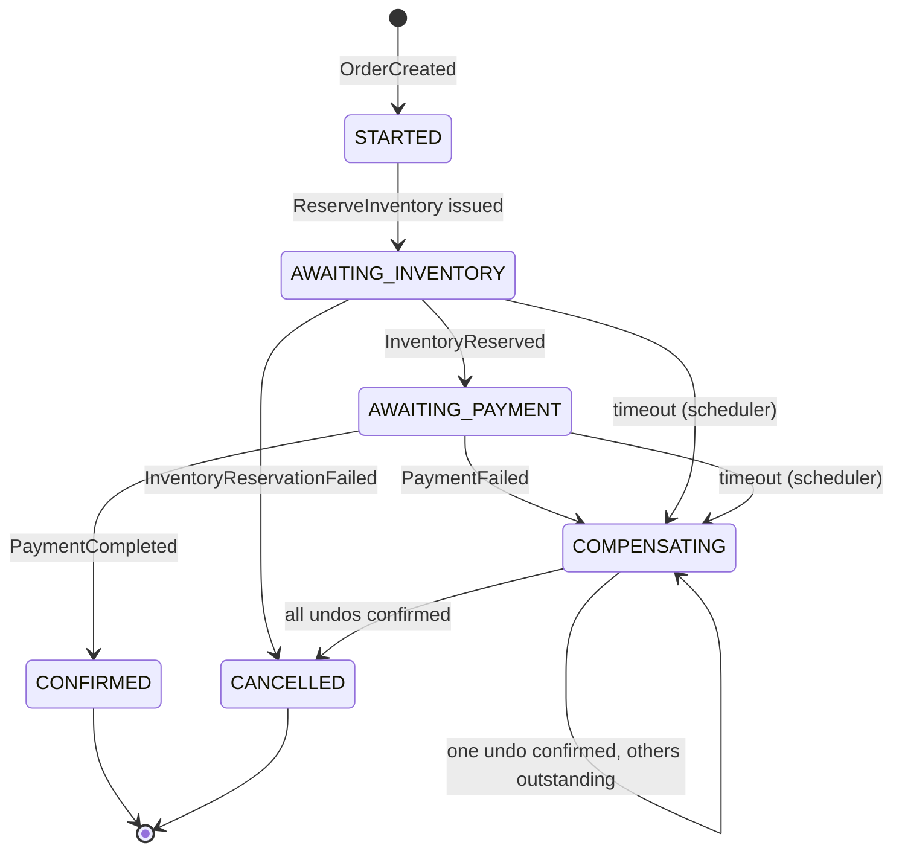

# Architecture — saga-fulfillment-engine

An order fulfillment system built on the **orchestration-based Saga pattern**, with a
scheduler that drives timeout-based compensation for sagas that stall.

This document is the design reference for the project. It is updated in the same commit
as any change that affects design.

**Status:** Chunks 0–8 complete. **The system is connected end to end**: an order created
over REST drives the full saga through inventory and payment and back, and the terminal
outcome reaches the customer as a notification. Every topic in §5.3 has both a producer and
a consumer, every consumer in the system dedups on message id (§6), and the timeout sweep
closes the last liveness gap (§4). Chunk 8 proves the chain end to end against real
infrastructure. What remains is a local run setup (Chunk 9).

> **One known open defect:** §8.5 — a compensating `ReleaseInventory` can overtake the
> stale `ReserveInventory` it compensates, leaking stock on a cancelled order. Found by the
> end-to-end suite, documented rather than quietly fixed, and not yet addressed.

> **"End to end" here means every link is implemented and unit-tested, not that the whole
> chain has been observed running.** The Testcontainers suites that would prove that have
> still never executed on the development machine (Docker is unreachable — see README);
> the cross-service seam closed in Chunk 5.5 was verified directly instead, in the way that
> chunk records. Chunk 8 is where "observed running" gets earned.

---

## 1. Goals and non-goals

### Goals

This is a **portfolio / learning project**. It exists to demonstrate, in working code:

- **Distributed transactions via the Saga pattern** — maintaining consistency across
  service boundaries without a distributed two-phase commit, using a sequence of local
  transactions plus compensating actions.
- **Orchestration, not choreography** — a single component owns the decision of what
  happens next, so the workflow is readable in one place instead of being smeared across
  event handlers.
- **Async, event-driven service communication** — services talk over Kafka, never by
  synchronous inter-service HTTP calls.
- **Timeout-based compensation** — a saga that never receives its next reply must not
  hang forever. A scheduler detects stalled sagas and drives them down the compensation
  path.
- **Idempotent message handling** — Kafka delivery is at-least-once, so handlers must
  tolerate redelivery without double-reserving inventory or double-charging a customer.
- **Distributed locking** — multiple scheduler instances must not act on the same stuck
  saga concurrently.

### Non-goals

- **Not production payment processing.** There is no integration with any real payment
  gateway. `payment-service` simulates outcomes (success/failure/delay) so the
  compensation paths can be exercised deterministically. Nothing here is PCI-compliant
  and none of it should be pointed at real money.
- **No real notification delivery.** `notification-service` renders a customer message and
  writes it to the log. There is no email, SMS, or push integration, and no notification
  history — the `NotificationSender` interface is where a real channel would attach.
- **No service discovery.** There is no Eureka, Consul, or Spring Cloud dependency
  anywhere in the project, and none is planned. Services find Kafka and their own database
  through configuration; they never call each other directly (§1), so there is nothing for
  a registry to resolve.
- **No real authentication, authorization, or multi-tenancy.**
- **No production hardening** — no rate limiting, no autoscaling, no SLA, no DR plan.
- **Not a Kafka Streams / event-sourcing showcase.** Saga state is kept in a relational
  table, deliberately, because that is the simpler and more explainable design.
- **Not a UI project.** REST endpoints and logs are the interface.

---

## 2. Services

> **Derived section.** The prompt referenced a service list that was not included, so
> these responsibilities are reconstructed from the saga flow in §3. Correct anything
> that diverges from the intended split.

| Service | Responsibility |
| --- | --- |
| **order-service** | Owns the `Order` aggregate and its lifecycle (`PENDING` → `CONFIRMED`/`CANCELLED`). Exposes the client-facing REST API for creating and reading orders. Publishes `OrderCreated`. Consumes `ConfirmOrder` / `CancelOrder` commands, applies the resulting status change, and announces it as `OrderConfirmed` / `OrderCancelled` — the terminal-state events notification-service consumes (§3.1). Source of truth for order data — **not** for saga state. |
| **inventory-service** | Owns stock levels and reservations. Consumes `ReserveInventory`, attempts to reserve, and reports `InventoryReserved` or `InventoryReservationFailed`. Consumes `ReleaseInventory` as the compensating action and reports `InventoryReleased`. Must be idempotent (§6). |
| **payment-service** | Owns payment records. Consumes `ProcessPayment` and reports `PaymentCompleted` or `PaymentFailed`. Payment outcome is **simulated** (§1 non-goals). Must be idempotent (§6) — this is where double-processing is most costly. |
| **notification-service** | Terminal-state side effects only. Consumes `OrderConfirmed` / `OrderCancelled` and emits a customer notification (logged/stubbed). Deliberately has no compensating action — a sent notification cannot be un-sent, which is why it runs only on terminal states. |
| **saga-orchestrator** | The brain. Owns the `Saga` record and its state machine (`STARTED` → `CONFIRMED` / `COMPENSATING` → `CANCELLED`). Consumes `OrderCreated` and every service reply, and is the **only** component that decides which command is issued next. Also owns each saga's timeout deadline, and exposes a query API used by `scheduler-service`. |
| **scheduler-service** | Liveness watchdog. Periodically asks `saga-orchestrator` for sagas past their deadline that are still in a non-terminal state, takes a Redis lock keyed by saga id, and triggers the same compensation path an explicit failure would (§4). Holds no saga state of its own. |

### 2.1 Order schema

The `Order` aggregate, owned by order-service:

| Field | Type | Notes |
| --- | --- | --- |
| `id` | `UUID` | Primary key. Also the partition key for `OrderCreated`, which precedes saga creation. |
| `userId` | `String` | Client-supplied identifier. Not validated against any user service. |
| `itemSku` | `String` | **Inventory item identifier**, in the same space as inventory-service's `itemId`. This is what gets reserved. |
| `item` | `String` | Free-text description for display. **Never** used to look up stock. |
| `quantity` | `int` | How many units to reserve. Minimum 1, enforced at both the API and the domain constructor. |
| `unitPrice` | `BigDecimal` | Price of **one** unit, `precision 19, scale 2`. Must be greater than zero. Client-supplied. |
| `amount` | `BigDecimal` | The order **total**, `precision 19, scale 2`. **Derived**, never supplied — see below. What payment-service charges. |
| `status` | `OrderStatus` | `PENDING` → `CONFIRMED` / `CANCELLED`. Only `PENDING` is non-terminal. |
| `createdAt` / `updatedAt` | `Instant` | Hibernate-managed. |

> **`itemSku` and `quantity` were a gap found while building inventory-service (Chunk 2).**
> The original schema had only the free-text `item` and a money `amount`, which meant
> `ReserveInventory` had no item identifier to reserve against and no quantity to reserve
> — the orchestrator would have had nothing to populate the command with. The fix is
> additive: `item` is kept as display text, and the two new fields carry the values the
> saga actually needs.
>
> `itemSku` has no enforced format. Matching inventory-service's `itemId` is a convention,
> not a constraint — a reservation for an unknown SKU fails at inventory-service with
> `UNKNOWN_ITEM` rather than being rejected at order creation, because order-service does
> not query inventory (that would be the synchronous inter-service call §1 rules out).

#### The total is derived

```
amount = unitPrice × quantity
```

`amount` is computed in `Order`'s constructor and is **not a parameter** of
`Order.create(...)` or of the REST request. There is deliberately no code path — no
setter, no builder, no test helper — that can persist a total inconsistent with the unit
price and quantity it sits beside. An order whose `amount` disagrees with its own
arithmetic is not a state the type can represent.

This resolves an ambiguity that stood until `unitPrice` was added: `amount` alongside a
`quantity` could plausibly have meant either the per-unit price or the line total, and
payment-service is about to charge it. It is the total.

`unitPrice` is normalised to 2 decimal places (`HALF_UP`) **before** the multiplication,
so the stored total is exactly the stored unit price times the stored quantity with no
rounding residue — `1.005 × 3` is stored as `1.01` and `3.03`, not `3.015`. A price that
rounds away to zero at that scale is rejected rather than silently made free.

`OrderCreatedEvent` carries `unitPrice` as well as `amount`, so a downstream consumer can
re-derive and audit the total instead of trusting it.

---

## 3. Saga flow

The happy path and both failure paths, explicitly. `saga-orchestrator` is the only
decision-maker at every branch.

### 3.1 Happy path

1. Client `POST`s to **order-service** to create an order, supplying `itemSku` and
   `quantity` alongside the description and amount (§2.1). The order is persisted with
   status **`PENDING`**.
2. **order-service** publishes **`OrderCreated`**, carrying `itemSku`, `quantity` and
   `amount` — the values the rest of the saga acts on.
3. **saga-orchestrator** consumes `OrderCreated`, creates a saga record with status
   **`STARTED`** and a **timeout deadline**, then publishes the **`ReserveInventory`**
   command, forwarding `itemSku` and `quantity` straight from the event. The orchestrator
   invents nothing here: everything it needs to reserve stock arrives with the order.
4. **inventory-service** consumes `ReserveInventory`, attempts the reservation, and
   publishes **`InventoryReserved`** on success.
5. **saga-orchestrator** consumes `InventoryReserved` and publishes the
   **`ProcessPayment`** command.
6. **payment-service** consumes `ProcessPayment` and publishes **`PaymentCompleted`** on
   success.
7. **saga-orchestrator** consumes `PaymentCompleted`, marks the saga **`CONFIRMED`**, and
   publishes the **`ConfirmOrder`** command.
8. **order-service** marks the order **`CONFIRMED`** and publishes the
   **`OrderConfirmed`** event; **notification-service** consumes it and notifies the
   customer. Saga is terminal.

> **Corrected in Chunk 4, and reaffirmed in Chunk 5.** Step 7 previously said the
> *orchestrator* publishes `OrderConfirmed`, which contradicted §5.3's listing of both
> terminal-state topics as order-service-produced. The listing is right and the step was
> loose: an order reaching `CONFIRMED` is a fact about the order aggregate, and §5.1 has
> events published by the service that owns the data. The orchestrator issues the
> *command*; order-service announces the *fact*. The same correction applies to the
> cancellation paths below.
>
> Chunk 5 briefly moved these back to the orchestrator on the argument that only it knows
> a saga has *finished*. That was reverted: notification-service is telling a customer
> their order was confirmed or cancelled, and order-service knowing its own order reached
> that status is entirely sufficient for that message. "The saga is complete" is a fact
> about the saga, not about the notification.
>
> **Implemented in Chunk 5.5**, and the implementation reinforced the argument: the event
> needs `userId`, `item` and `amount`, which live on the order aggregate. The orchestrator
> would have had to carry that data around to publish these, or ask for it — order-service
> simply reads its own row.

### 3.2 Failure path A — inventory reservation fails

Nothing has been reserved and nothing has been charged, so **no compensation is
required** — this is a straight cancellation.

1. Steps 1–3 as above.
2. **inventory-service** cannot reserve and publishes
   **`InventoryReservationFailed`**.
3. **saga-orchestrator** consumes it, marks the saga **`CANCELLED`**, and publishes the
   **`CancelOrder`** command.
4. **order-service** marks the order **`CANCELLED`**. Saga is terminal.

### 3.3 Failure path B — payment fails after inventory was reserved

This is the path that actually needs compensation: inventory is held and must be given
back.

1. Steps 1–5 as in the happy path — inventory **is** reserved.
2. **payment-service** publishes **`PaymentFailed`**.
3. **saga-orchestrator** consumes it, marks the saga **`COMPENSATING`**, and publishes
   **both**:
   - **`ReleaseInventory`** — the compensating command, and
   - **`CancelOrder`**.
4. **inventory-service** releases the reservation and confirms with
   **`InventoryReleased`**; **order-service** marks the order **`CANCELLED`**.
5. Once compensation is confirmed, **saga-orchestrator** moves the saga
   **`COMPENSATING` → `CANCELLED`**. Saga is terminal.

> **`COMPENSATING` → `CANCELLED` waits for acknowledgements, and they always arrive.**
> The orchestrator leaves `COMPENSATING` only once every compensating command it issued
> has been confirmed — `InventoryReleased` for `ReleaseInventory`, and `PaymentRefunded`
> for `RefundPayment` (§3.5). This is what makes the state honest: a saga in
> `COMPENSATING` genuinely means "an undo is still outstanding".
>
> That only works because those confirmations are **unconditional**. Both services publish
> them on every terminal outcome, including the no-op ones where there was nothing to undo
> — see §5.3.1. An earlier version of both handlers stayed silent on their no-op paths,
> which would have stranded a compensating saga forever in exactly the most common case:
> payment failed, so there was no payment to refund.

> The saga only reaches `CANCELLED` **after** compensation is acknowledged. A saga
> sitting in `COMPENSATING` means inventory has not yet been confirmed released — that
> distinction is what makes the state machine worth having, and it is exactly what §8
> tests hardest.

### 3.5 Compensating a saga where payment already succeeded

Path B needs no refund: the payment *failed*, so no money moved and releasing the stock
is the whole of the undo.

There is a third situation, and it is the one that makes `RefundPayment` necessary. A
payment can succeed and its `PaymentCompleted` reply then be lost — the broker drops it,
or the orchestrator dies before handling it. The saga sits in `STARTED` past its deadline,
the §4 sweep picks it up, and compensation runs against a saga that **did** take the
customer's money.

Compensating such a saga requires undoing *both* side effects:

- **`ReleaseInventory`** — hand the stock back, and
- **`RefundPayment`** — hand the money back.

`RefundPayment` is therefore addressed to payment-service in exactly the same way
`ReleaseInventory` is addressed to inventory-service, and is idempotent for the same
reason: it is reachable from a timeout, so it can genuinely arrive twice, and it can
arrive for a saga that never paid at all (a no-op, not an error).

> **Added in Chunk 3, and finally wired in Chunk 7.** The original §3 described only the two
> failure paths above and had no refund anywhere, which left the timeout-after-payment case
> with no way to return the money. Chunk 5 built the state machine but had no caller for
> this branch — nothing issued `RefundPayment`, because only a timeout can reach this
> situation and the timeout sweep did not exist yet.
>
> `compensateTimedOut` closes it: a saga stalled in `AWAITING_PAYMENT` gets **both**
> `ReleaseInventory` and `RefundPayment`, while one stalled in `AWAITING_INVENTORY` gets
> only the release — no payment was ever requested from that status, so asking for a refund
> would be asking payment-service about an order it has never seen.

### 3.4 State machine



`CONFIRMED` and `CANCELLED` are terminal. `STARTED`, `AWAITING_INVENTORY`,
`AWAITING_PAYMENT` and `COMPENSATING` are non-terminal and therefore eligible for timeout
sweeping.

The `AWAITING_*` states were added in Chunk 5. Without them a stalled saga cannot say
*what* it is stalled on, and the sweep cannot tell an unanswered reservation from an
unanswered payment — which matters because those two need different compensation
(§3.5): the first has nothing to undo, the second may have money to return.

**Which compensating commands a timeout issues depends on where the saga stalled:**

| Stalled in | Undo required |
| --- | --- |
| `AWAITING_INVENTORY` | Possibly `ReleaseInventory` — the reservation may or may not have happened. Issued unconditionally; the confirmation is unconditional too (§5.3.1). |
| `AWAITING_PAYMENT` | `ReleaseInventory` **and** `RefundPayment` — stock is definitely held, and the payment may have succeeded with its reply lost (§3.5). |

The self-loop is the partial-compensation case: the saga stays in `COMPENSATING` while any
dispatched undo is still unconfirmed.

---

## 4. Timeout and scheduler flow

A saga stalls when a reply never arrives — a consumer is down, a message was dropped, a
service crashed mid-handler. Without a watchdog the saga sits in `STARTED` forever while
inventory stays reserved.

**scheduler-service** runs on a fixed interval and:

1. **Queries `saga-orchestrator`** for sagas whose **timeout deadline has passed** and
   whose status is still **non-terminal** (`STARTED`, `AWAITING_INVENTORY`,
   `AWAITING_PAYMENT` or `COMPENSATING`).

   This is a **REST call** — `GET /internal/sagas/stuck` — not a direct read of the
   orchestrator's tables, and it is the one deliberate exception to §1's "no synchronous
   inter-service calls" rule. The reasoning, in full, because the exception is worth
   justifying:

   - **Why not read the database?** Each service owns its own schema (§7). A scheduler
     querying `sagas` directly would couple its deploys to the orchestrator's table layout
     and turn an internal table into an undeclared public API. The `StuckSagaResponse`
     projection can stay stable while the entity changes underneath it.
   - **Why is a synchronous call acceptable here?** §1's rule protects the *saga
     workflow*: no business step may block on another service answering, because that
     reintroduces the temporal coupling the saga pattern exists to remove. The scheduler is
     not a workflow participant — §4 calls it a liveness mechanism, not a correctness one.
     No saga waits on this endpoint; if it is unreachable the sweep is merely late, and
     nothing becomes incorrect. A poll is also genuinely a question rather than a fact, so
     request/response is the honest shape for it.
   - **Why not an event?** "Which sagas are stuck right now?" has no natural publisher —
     nothing *happens* when a deadline passes. Emitting timer ticks to fake one would be
     more machinery for less clarity.
2. For each such saga, **acquires a Redis lock keyed by saga id** before doing anything.
   The lock is what makes it safe to run more than one scheduler instance: exactly one
   instance handles a given stuck saga. A saga whose lock cannot be acquired is skipped
   this pass and retried next pass.
3. **Triggers the same compensation path an explicit failure would** — it does not
   invent a second recovery mechanism. A timed-out saga is routed into the identical
   `COMPENSATING` transition described in §3.3, so there is one compensation code path
   to reason about and to test.

   Concretely, `POST /internal/sagas/{sagaId}/compensate`. The scheduler sends a saga id
   and **nothing else**: which compensating commands to issue is decided entirely on the
   orchestrator side, by `compensateTimedOut`. Giving the scheduler no way to express
   anything more is what guarantees the timeout path cannot drift away from the explicit
   one — it is not merely a convention that they stay identical, there is only the one
   implementation.
4. **Releases the lock**, in a `finally` — on failure as well as on success. Releasing only
   after a successful compensation would keep a saga locked for the full TTL every time the
   orchestrator hiccupped, delaying the retry of exactly the saga that just failed. Locks
   also carry a TTL, so a scheduler that dies mid-pass does not wedge a saga permanently.

### 4.1 How the lock is built

`SET key token NX PX ttl` to acquire, and a Lua compare-and-delete to release. Both details
are load-bearing:

- **Acquisition is a single command.** Redis executes `SET ... NX` atomically, so of two
  instances racing for one saga exactly one gets `true`. A "check whether the key exists,
  then write it" version is two round trips with a gap in between, and *both* instances win
  — the failure is silent, and it is the one this chunk's concurrency test is built to
  catch.
- **Release is ownership-checked.** A bare `DEL` would be wrong: an instance whose TTL had
  lapsed would delete the lock its *successor* now holds, and a third instance could then
  take it while the second was still working. The token proves ownership, and the script
  compares it before deleting.

**Quartz clustering is deliberately not used.** Quartz can elect a single instance to fire a
trigger, but that coordinates at the wrong granularity: it would decide who runs *the
sweep*, leaving every other instance idle in an active/passive pair. §4 wants every instance
sweeping and coordinating per *saga*, so the work spreads and one slow instance does not
hold up the rest. Each instance therefore keeps its own in-memory Quartz schedule, and the
Redis lock is the only thing arbitrating between them.

`@DisallowConcurrentExecution` stops one instance overlapping its own passes if a sweep ever
outruns the interval. It says nothing about a second instance — that is the lock's job, and
conflating the two is an easy mistake to make when reading the code.

Design constraints worth stating:

- The lock TTL must exceed the expected handling time, or two instances could overlap.
- Because compensation is reachable both from an explicit `PaymentFailed` and from a
  timeout, compensation handlers must themselves be **idempotent** — a late reply can
  still arrive after the scheduler has already compensated.
- The scheduler is a *liveness* mechanism, not a *correctness* one. Correctness comes
  from the state machine; the scheduler only guarantees the saga eventually leaves a
  non-terminal state.

---

## 5. Kafka topic design

### 5.1 Orchestration, not choreography

**Only `saga-orchestrator` decides the next step.** Every other service is a pure
executor: it consumes a command addressed to it, performs one local transaction, and
publishes a result event. No service consumes another service's event and independently
decides to act on it. There is no implicit workflow hiding in the wiring.

Concretely: `inventory-service` never listens for `PaymentFailed` and decides to release
stock on its own. It waits to be told, via `ReleaseInventory`. That indirection is the
entire point of orchestration — the workflow lives in one readable state machine instead
of being an emergent property of who happens to subscribe to what.

### 5.2 Naming convention

```
<context>.<kind>.<name>.v<n>
```

- `<context>` — the owning bounded context (`order`, `inventory`, `payment`, `saga`)
- `<kind>` — `commands` (imperative, addressed to exactly one consumer, "do this") or
  `events` (past tense, a fact, broadcast, "this happened")
- `<name>` — kebab-case message name
- `v<n>` — schema version, so a breaking payload change is a new topic rather than a
  silent break

### 5.3 Topics

**Commands** — published by `saga-orchestrator`, consumed by the owning service:

| Topic | Consumer |
| --- | --- |
| `inventory.commands.reserve-inventory.v1` | inventory-service |
| `inventory.commands.release-inventory.v1` | inventory-service (compensation) |
| `payment.commands.process-payment.v1` | payment-service |
| `payment.commands.refund-payment.v1` | payment-service (compensation) |
| `order.commands.confirm-order.v1` | order-service |
| `order.commands.cancel-order.v1` | order-service |

**Events** — published by the owning service, consumed by `saga-orchestrator` (and by
`notification-service` for terminal states):

| Topic | Producer |
| --- | --- |
| `order.events.order-created.v1` | order-service |
| `inventory.events.inventory-reserved.v1` | inventory-service |
| `inventory.events.inventory-reservation-failed.v1` | inventory-service |
| `inventory.events.inventory-released.v1` | inventory-service |
| `payment.events.payment-completed.v1` | payment-service |
| `payment.events.payment-failed.v1` | payment-service |
| `payment.events.payment-refunded.v1` | payment-service (compensation confirmation) |
| `order.events.order-confirmed.v1` | order-service |
| `order.events.order-cancelled.v1` | order-service |

> **The two terminal-state order topics had no producer until Chunk 5.5, and now do.**
> order-service published only `OrderCreated`; it consumed `ConfirmOrder` / `CancelOrder`
> and applied the status change *silently*, so `notification-service` was a complete
> consumer with nothing feeding it and its `OrderConfirmedEvent` / `OrderCancelledEvent`
> records were a contract **authored** by Chunk 4 rather than one confirmed against a
> producer.
>
> Chunk 5.5 closed that: order-service publishes both events when it applies a terminal
> status — §3.1 explains why it and not the orchestrator — and every topic in this section
> now has a producer and a consumer. The contract was matched to notification-service's
> existing records field for field rather than re-derived, since both sides were built
> independently; `TerminalEventContractTest` in order-service pins the field names, and is
> the mirror of the orchestrator's `OutboundContractTest`.
>
> **What the two records could not take from the command.** `ConfirmOrder` and
> `CancelOrder` carry only `messageId`, `sagaId` and `orderId`, while
> notification-service needs `userId`, `item` and `amount` to write a customer message.
> Those come from the order aggregate, which order-service owns — so the producing service
> had to be the one that already holds the data, which is the same conclusion §3.1 reaches
> from the ownership argument. `sagaId` can only come from the command.

### 5.3.1 Compensation confirmations are unconditional

`InventoryReleased` and `PaymentRefunded` are **compensation confirmations**, and they
carry identical semantics on purpose: *compensation for this order is complete, stop
waiting.*

Both are published on **every terminal outcome** of their handler, including the outcomes
where there was nothing to undo — no active reservation, no successful payment. That is
not a technicality. Most compensations follow a payment that failed, so "nothing to
refund" is the **common** case, not the edge case; a handler that stayed silent there
would strand the majority of compensating sagas in `COMPENSATING` forever, waiting on an
acknowledgement that was never going to come.

Each event carries a `CompensationOutcome`:

| Value | Meaning |
| --- | --- |
| `REVERSED` | There was something to undo, and it was undone. |
| `NOTHING_TO_REVERSE` | There was nothing to undo. Equally final. |

The orchestrator treats both identically when leaving `COMPENSATING`. The distinction
exists purely so the audit trail can still tell the two apart — a saga that returned real
stock and a saga that had never reserved any are equally finished, but they are not the
same story.

**The one exception is a redelivered `messageId`, which publishes nothing.** That is not a
new outcome; it is the same outcome arriving twice, which is exactly what the idempotency
guard of §6 exists to suppress. The original confirmation was already sent.

### 5.4 Partitioning and ordering

All messages are **keyed by saga id** (order id for `OrderCreated`, which precedes saga
creation). Same key → same partition → per-saga ordering is preserved, which is the only
ordering guarantee the state machine actually needs. Ordering *across* sagas is
irrelevant and is deliberately not guaranteed.

### 5.5 Message envelope

Every message carries, at minimum:

| Field | Purpose |
| --- | --- |
| `messageId` | Unique per message. The idempotency key (§6). |
| `sagaId` | Correlation across the whole saga. Also the partition key. |
| `orderId` | Business correlation. |
| `type` | Message type discriminator. |
| `occurredAt` | Timestamp. |

---

## 6. Idempotency

**Kafka delivery is at-least-once.** A consumer that processes a message, then dies
before committing its offset, will see that message again on restart. Rebalances cause
the same thing. This is normal operation, not an error case.

Without protection, that means:

- `inventory-service` **double-reserves** stock — the same order silently consumes twice
  its quantity.
- `payment-service` **double-charges** the customer.

**Requirement:** `inventory-service` and `payment-service` must each track the
`messageId`s of commands they have already processed. The implementation is a
`processed_commands` table whose **primary key is the message id**, written **in the same
local transaction** as the business change, so the dedup record and the effect commit
atomically or not at all — a marker able to commit without its effect would permanently
suppress a command that never took place.

**Implemented in `inventory-service` (Chunk 2), `payment-service` (Chunk 3),
`notification-service` (Chunk 4** — as `processed_messages`, since it consumes events
rather than commands**), and `saga-orchestrator` (Chunk 6),** all with the same message-id
primary key. Every consumer in the system now has one. A duplicate is a logged no-op that
does **not** re-publish the original result. If the original reply was genuinely
lost, the saga stalls and the §4 timeout sweep is what recovers it; re-publishing from a
stored outcome is a possible refinement, deliberately not built, because it would
duplicate recovery logic the scheduler already owns.

An application-level "already processed?" lookup is only a fast path for the common case.
The primary key is the real guarantee: two genuinely concurrent deliveries can both pass
that lookup, and the second insert then fails, rolling its transaction back so the work is
never done twice.

The same applies to compensating commands — §4 notes that compensation is reachable from
both an explicit failure and a timeout, so `ReleaseInventory` can genuinely arrive twice.

`saga-orchestrator` has the equivalent protection on the reply side **as of Chunk 6**: a
duplicated `PaymentCompleted` must not drive a second `OrderConfirmed`. Same
`processed_messages` table, same message-id primary key, written in the same transaction as
the transition.

Its state machine already helped — a transition out of `CONFIRMED` is invalid, so a late
reply was dropped — but the two guards answer different questions, and the difference is
not cosmetic:

- The **status guard** asks *"does this reply fit where the saga is now?"*
- The **dedup table** asks *"have I already handled this exact message?"*

The gap between them is two deliveries of the same reply that both arrive while the saga is
still in the status that reply is valid from. Both pass the status check, and the machine
advances twice — issuing the next command twice. Sequentially the first delivery's
transition closes that window; concurrently it does not, which is why the primary key and
not the lookup is the real guarantee.

**The guard runs in front of the state machine**, so a redelivery costs one indexed lookup
and touches nothing else — no saga load, no step appended. Two deliberate asymmetries:

| Path | Marked processed? | Why |
| --- | --- | --- |
| Handled, or rejected by the status guard | **Yes** | It was handled; the answer was "no". Leaving it unmarked would append a fresh `(ignored)` step to the append-only history on every redelivery — a flakier broker would mean a noisier audit trail. |
| `UNKNOWN_SAGA` | **No** | Nothing changed, so there is nothing to protect, and swallowing the id would permanently suppress a reply whose saga was merely not visible yet. Replaying it costs a log line. |

The guard covers the trigger event as well as the six replies, not just "the reply side" as
this section originally scoped it. One rule for *have I seen this message* is easier to
reason about than one rule with an exception, and `OrderCreated`'s existing `orderId`
lookup stays — it catches a genuinely different thing, a *second* `OrderCreated` for the
same order, which is a different message with a different id rather than a redelivery.

### 6.1 order-service is a special case

`order-service` does **not** need a `processed_commands` table, and deliberately does not
have one. Its two commands both drive the order into a *terminal* status, and the order
records which status it reached — so the order's own `status` column already is the
idempotency key. A redelivered `ConfirmOrder` against an order that is already
`CONFIRMED` is detectably redundant with no extra bookkeeping.

That reasoning does **not** transfer to `inventory-service` or `payment-service`:
"reserve 3 units" and "charge $40" are not self-describing, so replaying them is
indistinguishable from a legitimate second request. Those services need the explicit
dedup table.

`order-service` therefore distinguishes three non-applying outcomes, all logged no-ops
rather than errors:

| Outcome | Condition |
| --- | --- |
| `DUPLICATE_IGNORED` | Order already holds the requested status — plain redelivery. |
| `CONFLICT_IGNORED` | Order is terminal in the *other* status. A terminal order never flips. |
| `ORDER_NOT_FOUND` | No such order. Ignored rather than thrown, so the consumer cannot spin on a poison message. |

**None of the three publishes a terminal-state event.** Since Chunk 5.5 the status change
and its `OrderConfirmed` / `OrderCancelled` announcement happen together in one
transaction, on the `APPLIED` path and nowhere else — the same "a duplicate does not
re-publish" rule §5.3.1 states for the compensation confirmations.

That suppression has to live **here**, and cannot be delegated downstream.
notification-service dedups on `messageId`, but a re-published event would carry a *fresh*
one — it is a new message announcing an old fact — so it would pass that guard cleanly and
the customer would be told twice. A sent notification cannot be un-sent (§2). The order's
`status` column is what actually protects them.

> **Implementation happens in a later chunk** for the other services. This section records
> the requirement so it is not rediscovered late.

---

## 7. Repository structure

**Maven multi-module monorepo.** One deployable artifact per module; a single repository
for portfolio manageability.

The reasoning: six separately-deployable services genuinely are six artifacts, and each
module builds its own runnable jar — the module boundary is real, not cosmetic. But six
separate repositories for a portfolio project would mean six clone URLs, six CI configs,
and cross-cutting changes split across six pull requests, for zero benefit at this scale.
A reviewer should be able to read the whole system in one place.

```
saga-fulfillment-engine/
├── pom.xml                  # parent (packaging: pom) — module list, dependency mgmt
├── ARCHITECTURE.md
├── README.md
├── order-service/
├── inventory-service/
├── payment-service/
├── notification-service/
├── saga-orchestrator/
└── scheduler-service/
```

Shared message contracts currently live per-service. If duplication becomes painful, a
`common-contracts` module is the intended escape hatch — deliberately deferred rather
than built speculatively.

---

## 8. Testing strategy

### 8.1 Unit tests

Per service, fast, no infrastructure. Business rules in isolation: state machine
transitions, reservation arithmetic, payment outcome simulation, deadline computation.

The `saga-orchestrator` state machine is a pure function of (current state, incoming
event) and should be tested exhaustively at this level — including transitions that must
be **rejected**.

### 8.2 Integration tests — Testcontainers

Real **Kafka**, **Postgres**, and **Redis** in containers. No embedded fakes, no mocked
brokers; the redelivery and locking semantics under test only exist in the real thing.

Covers: publish/consume round-trips, persistence, and Redis lock acquisition/expiry.

> **These did not run at all from Chunk 1 until Chunk 8.** Testcontainers rejected the
> development machine's Docker daemon, so every one of these classes skipped silently for
> six chunks while the build stayed green. The cause turned out to be a Testcontainers
> version too old to negotiate the installed Docker's API version, and a bump from
> `1.21.0` (the Spring Boot 3.5.0 default) to `1.21.4` fixed it outright — no workaround,
> no hand-rolled container management. The version is pinned explicitly in the parent pom
> so a Spring Boot upgrade cannot quietly walk it back.
>
> Running them turned up **three real defects that had been sitting in `main`**, described
> in the Chunk 8 checklist entry. That is the argument for this whole section in one line:
> a test that has never executed is not evidence of anything.

### 8.3 Failure and compensation paths — the part that matters

Happy-path tests prove almost nothing about a Saga system. The value of this project is
in what happens when steps fail, and that is exactly what tends to be under-tested. Each
of the following is an explicit, named test case:

1. **Inventory reservation fails** (§3.2) → saga reaches `CANCELLED`, order is
   `CANCELLED`, and **no** `ProcessPayment` is ever published.
2. **Payment fails after reservation** (§3.3) → saga passes **through** `COMPENSATING`,
   `ReleaseInventory` is published, stock returns to its pre-saga level, and the saga
   only then reaches `CANCELLED`. Asserting the intermediate state is the point — a test
   that only checks the final status would pass even if compensation never ran.
   **Done end to end in Chunk 8** (§8.4), across all six real services: payment declines
   at 1200.00 against the 1000.00 threshold, stock returns to exactly its pre-saga level,
   and the customer receives the cancellation message.
3. **Timeout with no reply** (§4) → a saga is created, the reply is deliberately never
   sent, and the scheduler drives it into the same compensation path. Asserted by
   advancing a controllable clock, not by sleeping.
   **Done end to end in Chunk 8** (§8.4), by stopping inventory-service's listeners so the
   reply genuinely never arrives. This is the test that surfaced the §8.5 defect.
4. **Duplicate command delivery** (§6) → the same `ReserveInventory` / `ProcessPayment`
   is delivered twice; stock is decremented **once** and the customer is charged
   **once**. This test must fail before idempotency is implemented, or it is not testing
   anything.
5. **Concurrent schedulers on one stuck saga** (§4) → two scheduler instances sweep the
   same saga simultaneously; the Redis lock ensures compensation is triggered exactly
   once. **Done in Chunk 7** and, unusually for this repo, actually executed: it needs only
   a plain Redis on a port rather than the Testcontainers setup Docker blocks here.
   16 threads race for one saga id against a real Redis and exactly one wins. The harness
   was checked against a deliberately broken check-then-set lock first, which lets all 16
   through — so the test is known to discriminate rather than merely to pass.
6. **Late reply after compensation** (§4) → a `PaymentCompleted` arrives *after* the
   scheduler already compensated. The saga must not resurrect into `CONFIRMED`.
7. **Compensation itself fails** → `ReleaseInventory` errors. The saga must remain in
   `COMPENSATING` and stay visible to the scheduler for retry, rather than being
   silently marked `CANCELLED`.

Cases 6 and 7 are the ones most often missed, and are the reason the `COMPENSATING`
state is modelled explicitly rather than collapsed into `CANCELLED`.

### 8.4 End-to-end tests — the whole chain at once

`integration-tests` is a module with no production code whose entire job is to run the
system as a system. It boots one Kafka, one Postgres, one Redis and **all six services**,
then drives real orders through them.

**Why it has to exist.** Every other suite proves one service in isolation. Nothing proved
they talk to each other — and the seams here are exactly where this design is most fragile:
message contracts are duplicated across module boundaries by choice (§7), the wire is JSON
resolved against the consumer's declared record with no schema registry, and a mismatch
surfaces as a `null` field rather than a compile error. Contract tests pin the field names;
only this suite proves a message actually leaves one service and arrives at the next.

**What is real:** every topic, consumer group, database row and HTTP call. One Postgres
database per service, because notification-service and saga-orchestrator both own a
`processed_messages` table and inventory-service and payment-service both own
`processed_commands` — sharing one database would have them overwriting each other's dedup
records.

**What is not, stated plainly:** the six services run as six Spring contexts in **one JVM**,
not six processes. This suite exercises message flows, persistence and the state machine; it
does not exercise process isolation or independent deployment. The only substitution
anywhere in it is a controllable `Clock` in the orchestrator, and that replaces a clock, not
a collaborator.

**How the timeout case avoids a sleep.** inventory-service's Kafka listeners are genuinely
stopped, so `ReserveInventory` sits unconsumed and the saga really does stall — the §4
situation of "a consumer is down", not a simulated one. The clock is then advanced past the
deadline, the scheduler's own sweep picks the saga up unaided, and the listeners are
restarted so the release is processed for real and the saga can leave `COMPENSATING`. This
is what §8.3 case 3 means by "advancing a controllable clock, not by sleeping".

**Services must be usable as libraries for this to work.** `spring-boot-maven-plugin`
would otherwise replace each module's jar with a fat jar whose classes sit under
`BOOT-INF/classes/`, which compiles fine in the reactor and then fails at runtime with
`NoClassDefFoundError`. The plugin is configured in the parent pom to attach the runnable
jar under the `exec` classifier instead, so `module.jar` stays an ordinary library and
`module-exec.jar` is the one you run.

**Topics are pre-created by the fixture**, before any service starts. Each service declares
`NewTopic` beans only for topics it *owns*, so whichever starts first subscribes to topics
that do not exist yet — and the dependency is a cycle, so no start order avoids it. A
consumer subscribed to a missing topic does not fail; it logs `UNKNOWN_TOPIC_OR_PARTITION`
and waits for its next metadata refresh, which defaults to **five minutes**. The service
looks healthy and consumes nothing. Pre-creating also matches what §5.3 already says
happens in production, where topic creation is an operations concern.

### 8.5 Open defect — compensation can overtake the command it compensates

**Found by §8.4's timeout test, on 2026-08-16. Not yet fixed.**

When a saga times out while `AWAITING_INVENTORY`, the orchestrator issues
`ReleaseInventory` (§3.4 — issued unconditionally, because the reservation may or may not
have happened). But the saga is in that state precisely *because* `ReserveInventory` has
not been consumed yet. Those two commands travel on **different topics**, and §5.4's
per-saga ordering guarantee — same key, same partition — only holds **within one topic**.
Nothing orders them relative to each other.

So the compensating command can be consumed first. Observed exactly that, 62ms apart:

```
12:44:38.066  ReleaseInventory ... no active reservation to reverse; confirming anyway
12:44:38.128  Reserved 2 of SKU-c46c81b3 for order 1eaa83ee-...  (8 available, 2 reserved)
12:44:38.194  Saga f6e999d2-... CANCELLED: compensation complete
```

The release found nothing to reverse and — correctly, per §5.3.1 — confirmed anyway. The
stale reserve then took the stock. **The order is `CANCELLED`, the saga is `CANCELLED`, and
two units stay reserved forever.** Stock is leaked, and every participant believes it
behaved correctly, which is what makes this the interesting kind of bug.

Note what is *not* wrong here: §5.3.1's unconditional confirmation is still right, and
without it the saga would have stranded in `COMPENSATING` instead. The gap is that
inventory-service treats each command independently and has no way to know that a release
it has already handled invalidates a reserve it has not.

**Candidate fix, deliberately not applied in Chunk 8** because it changes compensation
semantics rather than test infrastructure: have `release` record a tombstone for the order
when there is nothing to reverse, and have `reserve` refuse an order that already carries
one. That makes the outcome independent of arrival order, which is the actual requirement —
the ordering cannot be guaranteed by the broker and should not be assumed.

The §8.4 timeout test deliberately does **not** assert stock restoration on this path. It
asserts what the system genuinely does — the sweep detects the stall, compensation runs,
the order reaches `CANCELLED`, the customer is notified, and the saga leaves `COMPENSATING`
only once the undo is acknowledged. Asserting restoration would be asserting behaviour that
does not exist; asserting the leak would enshrine it as correct.

---

## 9. Git branching strategy

> **Assumed** from the project's standing rules — "same as before" referenced a prior
> convention not restated in this prompt.

- Work happens on **`feature/<short-name>`** or **`fix/<short-name>`** branches.
- **Never commit directly to `main`** unless explicitly instructed.
- One branch per chunk, matching the checklist in §10.
- A change that affects design updates **`ARCHITECTURE.md` in the same commit**.
- The §10 checklist is updated as part of the chunk it describes.

---

## 10. Chunk checklist

> **Service ordering is authoritative.** The Chunk 0 draft of this list was derived from
> the architecture rather than supplied, and put `saga-orchestrator` before
> `inventory-service` and `payment-service`. The intended sequence is the reverse: build
> every executor service first, then the orchestrator that drives them, then the
> scheduler.
>
> **order-service → inventory-service → payment-service → notification-service →
> saga-orchestrator → scheduler-service.**
>
> Non-service chunks (idempotency, integration suite, docs) are interleaved where they
> make sense and do not change that sequence.

Update after every chunk.

- [x] **Chunk 0 — Architecture and scaffolding.** `ARCHITECTURE.md`, root multi-module
      `pom.xml`, six empty skeleton modules, `.gitignore`, `README.md` stub, git init.
      *Branch: `main` (explicitly authorized).*
- [x] **Chunk 1 — order-service.** `Order` entity and persistence, REST API for create
      and read, `PENDING` status, publishes `OrderCreated`, consumes `ConfirmOrder` /
      `CancelOrder` with consumer-level idempotency (§6.1). *Branch:
      `feature/order-service`.*
      **Caveat:** the Testcontainers integration tests are written but have never
      executed — Docker is unreachable from the dev machine (see README). Only the unit
      tests are proven green.
- [x] **Chunk 2 — inventory-service.** Stock model, `ReserveInventory` and
      `ReleaseInventory` handlers, publishes `InventoryReserved` /
      `InventoryReservationFailed` / `InventoryReleased`, **plus its own
      `processed_commands` dedup** (pulled forward from Chunk 6). *Branch:
      `feature/inventory-service`.*
      **Caveat:** as with Chunk 1, the Testcontainers integration tests are written but
      have never executed — Docker is unreachable from the dev machine (see README). Only
      the unit tests are proven green, and they stub the dedup lookup, so the
      database-enforced half of the idempotency guarantee is unverified.
- [x] **Chunk 3 — payment-service.** Payment record, simulated outcomes, consumes
      `ProcessPayment`, publishes `PaymentCompleted` / `PaymentFailed`; consumes
      `RefundPayment` as the compensating action (new — see §3.5); **plus its own
      `processed_commands` dedup** (pulled forward from Chunk 6, as inventory-service's
      was). *Branch: `feature/payment-service`.*
      **Failure trigger:** payments strictly above `payment.simulation.failure-threshold`
      (default `1000.00`) fail deterministically. Order a total above it — e.g.
      `unitPrice 600.00 x quantity 2` — or set the threshold to `0` to fail everything.
      **Caveat:** as with Chunks 1 and 2, the Testcontainers integration tests are written
      but have never executed — Docker is unreachable from the dev machine (see README).
      Only the unit tests are proven green.
- [x] **Chunk 4 — notification-service.** Consumes `OrderConfirmed` / `OrderCancelled`,
      renders a customer message and logs it via `NotificationSender`. No REST API, no
      Eureka (none exists in this project — see §1 non-goals), **plus its own
      `processed_messages` dedup**, which matters more here than anywhere else because a
      sent notification cannot be un-sent. *Branch: `feature/notification-service`.*
      **~~Blocked end to end~~ — unblocked by Chunk 5.5**, which gave both topics their
      producer. The event records authored here were the contract order-service was
      matched to, unchanged; they are now confirmed against a real producer rather than
      merely asserted.
      **Caveat:** as with Chunks 1–3, the Testcontainers integration tests are written but
      have never executed — Docker is unreachable from the dev machine (see README).
- [x] **Chunk 5 — saga-orchestrator.** `Saga` entity with a configurable timeout deadline,
      an append-only `saga_steps` history, and the complete state machine of §3 including
      the `AWAITING_*` states. Consumes `OrderCreated` and all six service replies, and
      issues every command. Exposes `GET /internal/sagas/stuck` for scheduler-service
      (§4 explains why REST). *Branch: `feature/saga-orchestrator`.*
      **Publishes no terminal-state events** — those remain order-service's (§3.1). A
      draft of this chunk moved them here and was reverted; `OutboundContractTest` now
      asserts the orchestrator declares no such record, so the boundary fails loudly if
      reintroduced.
      **`COMPENSATING` → `CANCELLED` waits for confirmations** rather than marking
      optimistically — see §3.3.
      **~~Not yet idempotent~~ on the reply side — closed by Chunk 6.** The state-machine
      guard rejects replies invalid from the current status, which covers the common
      duplicate, but it was never a substitute for a `processed_messages` table.
      **No Testcontainers suite** for this module — deliberately, see Chunk 8.
- [x] **Chunk 5.5 — order-service terminal-state events. The system is now connected end
      to end.** order-service publishes `OrderConfirmed` when it applies `ConfirmOrder` and
      `OrderCancelled` when it applies `CancelOrder`, closing the one gap that left
      notification-service a finished consumer with no producer (§5.3). *Branch:
      `feature/order-service-terminal-events`.*
      **Numbered 5.5 rather than 6** because "Chunk 6" is referenced by name from Chunks 2
      and 3 and from §6 as the idempotency work; renumbering would have invalidated those
      references to save nothing. The insertion point is where the work actually belongs in
      sequence — after the orchestrator existed to issue the commands.
      **The contract was matched, not designed.** Both sides were built independently, so
      the two new records copy notification-service's `OrderConfirmedEvent` /
      `OrderCancelledEvent` field for field. `TerminalEventContractTest` pins those names,
      the same job the orchestrator's `OutboundContractTest` does — a renamed field on a
      wire with type headers off does not fail to compile, it arrives as `null` and a
      customer is told "Your order for null (null) is confirmed."
      **`sagaId` comes from the command; `userId`, `item` and `amount` come from the
      order.** The commands carry no order detail, so the publishing service had to be the
      one holding the aggregate (§3.1, §5.3).
      **Idempotency:** publishing happens on the `APPLIED` path only, so a redelivered or
      conflicting command changes nothing and announces nothing (§6.1 explains why
      notification-service's own dedup cannot cover this case).
      **Verified without Docker.** Testcontainers still cannot start here, so the
      cross-service seam was checked directly instead: order-service's real
      `JsonSerializer` (type headers off, as configured) was used to serialize both events,
      and notification-service's real `StringJsonMessageConverter` to deserialize them into
      *its* records and render the customer messages — both modules' compiled classes, no
      shared code, every field surviving and both messages rendering clean. That covers the
      payload contract, which was the actual risk. It does **not** cover the broker path
      itself — partition keys, offsets, listener wiring — which the integration tests
      written here cover and which stay unrun until Chunk 8.
- [x] **Chunk 6 — idempotency (orchestrator only).** Dedup on the orchestrator's reply
      side (§6): a duplicated `PaymentCompleted` must not drive a second `OrderConfirmed`.
      inventory-service's landed in Chunk 2 and payment-service's in Chunk 3, so this was
      all that remained. Kept ahead of scheduler-service because §4 compensation is
      reachable from both an explicit failure and a timeout. *Branch:
      `feature/orchestrator-idempotency`.*
      **Same table, same key, same transaction** as the other three services —
      `processed_messages` with a message-id primary key, written alongside the transition.
      **Widened past "the reply side"** to cover `OrderCreated` too, so there is one rule
      for message identity rather than one rule with an exception; §6 records why, and the
      existing `orderId` guard stays because it catches a different thing.
      **The status guard was not enough, and §6 now says why** rather than leaving it at
      "explicit dedup is clearer": status and identity are different questions, and two
      concurrent deliveries of a reply valid from the current status pass the status check.
      The primary key, not the lookup, is what closes it.
      **`UNKNOWN_SAGA` is deliberately not marked**, so a reply whose saga is not yet
      visible stays eligible for redelivery.
      **No Testcontainers suite** for this module still — see Chunk 8. The
      database-enforced half of the guarantee (the primary key under genuine concurrency)
      is therefore asserted in design but unverified in execution, exactly as it is in
      Chunks 2 and 3.
- [x] **Chunk 7 — scheduler-service.** Timeout sweep, orchestrator query API, Redis
      distributed lock, compensation trigger (§4). *Branch: `feature/scheduler-service`.*
      **Quartz on a configurable interval** (`scheduler.interval`, default 30s), each
      instance holding its own in-memory schedule. Quartz clustering was considered and
      rejected — §4.1 explains why coordinating per *saga* beats coordinating per *trigger*.
      **The Redis lock is the point of the chunk**, and §4.1 records both load-bearing
      details: `SET NX PX` for atomic acquisition, Lua compare-and-delete for
      ownership-checked release. The lock is released in a `finally`, so a failed
      compensation gives it straight back rather than holding it for the whole TTL.
      **Compensation is triggered, never implemented here.** The scheduler posts a saga id
      to `POST /internal/sagas/{sagaId}/compensate` and can express nothing else, so the
      timeout path is the explicit-failure path by construction rather than by discipline.
      That endpoint and `compensateTimedOut` are new orchestrator code in this chunk, and
      they close the §3.5 `RefundPayment` gap that has been open since Chunk 3.
      **The concurrency test actually ran** — see §8.3 case 5. This is the first chunk
      since Chunk 0 whose headline guarantee is verified in execution rather than deferred
      to Chunk 8, because a plain `docker run redis` is reachable here even though
      Testcontainers is not. *(Chunk 8 fixed Testcontainers and moved these tests onto a
      managed Redis container, so the manual step is gone and they no longer skip.)*
      **Still unverified:** the sweep against a *real* orchestrator over HTTP. The
      orchestrator is mocked in `SchedulerWiringTest`; only the Quartz schedule and the
      Redis lock are real. Chunk 8.
- [x] **Chunk 8 — integration test suite.** Testcontainers harness plus the end-to-end
      suite. *Branch: `feature/integration-suite`.*
      **Testcontainers was fixed properly, not worked around.** The blocker since Chunk 1
      was a version too old to negotiate the installed Docker's API version; `1.21.0` →
      `1.21.4` resolved it with no workaround, and the version is now pinned in the parent
      pom so a Spring Boot upgrade cannot walk it back. Chunk 7's manual
      `docker run` approach was the prepared fallback and turned out not to be needed.
      **Nothing in the repository skips any more.** Every previously-skipped test runs —
      across order, inventory, payment and saga-orchestrator — and Chunk 7's Redis lock
      tests moved off their hand-started container onto a managed one, so `Skipped: 0` now
      holds in every module. A non-zero skip count is a regression signal rather than the
      normal state of this build.
      Running the previously-skipped tests for the first time found **three real defects
      that had been sitting in `main`**:

      1. **inventory-service and payment-service could not serialize their own events.**
         Neither has `spring-boot-starter-web`, so neither had `jackson-datatype-jsr310`,
         and spring-kafka's `JsonSerializer` registers the Java 8 date/time module only if
         it is on the classpath. Every event they publish carries an `Instant occurredAt`.
         **This was a production bug, not a test bug** — in a running system neither service
         could have emitted a single event.
      2. **notification-service could not deserialize the events it exists to consume**,
         for the same missing module. It would have failed on every message, silently,
         visible only in consumer logs.
      3. Two integration tests could never have passed as written: they autowired an
         `ObjectMapper` bean that does not exist without the web starter, and
         notification-service's test published event records through a producer it had
         never configured a JSON serializer for. Both failed at context load and had done
         since the day they were written.

      The first two are the argument for this chunk in a sentence: **a test that has never
      executed is not evidence of anything**, and two of these would have taken the system
      down in production while every suite reported green.
      **New `integration-tests` module** — see §8.4 for what it does and, just as
      importantly, what it does not: six Spring contexts in one JVM rather than six
      processes, with one substituted `Clock` and nothing else.
      **Services are now library-usable** (`spring-boot-maven-plugin` attaches the runnable
      jar under the `exec` classifier), because a module cannot be both a fat jar and a
      dependency. Chunk 9's run instructions need the `-exec` name.
      **The end-to-end suite found a fourth defect, and a design one** — §8.5. A
      compensating `ReleaseInventory` can be consumed before the stale `ReserveInventory`
      it compensates, because the two are on different topics and §5.4's ordering guarantee
      is per topic. The order and saga both reach `CANCELLED` while the stock stays
      reserved forever, with every service believing it behaved correctly.
      **Left unfixed on purpose:** the fix changes compensation semantics, not test
      infrastructure, and belongs in a chunk of its own rather than being folded in here.
      §8.5 records the candidate fix and the evidence.
      **§8.3 cases 1, 2 and 3 are now covered end to end.** Cases 4-7 remain covered only
      at the single-service level: duplicate delivery (4) by each service's own suite, and
      concurrent schedulers (5) by Chunk 7's Redis test. **Cases 6 and 7 — a late reply
      after compensation, and a compensation that itself fails — still have no end-to-end
      coverage**, and §8.3 names them as the two most often missed.
- [ ] **Chunk 9 — local run and docs.** `docker-compose` for Kafka/Postgres/Redis,
      README run instructions, observability pass.
